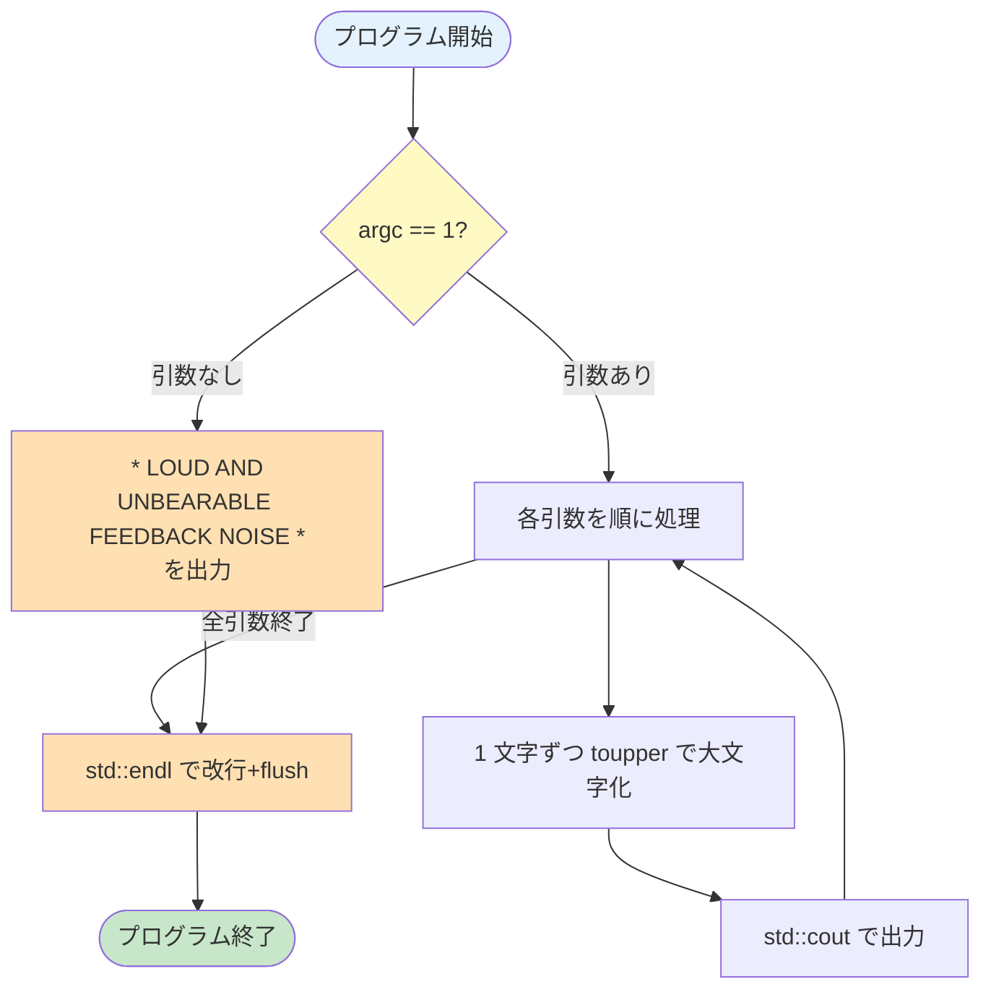

# ex00 — Megaphone

---

## このプログラムは何？

**文字を大文字に変換するプログラム**です。

コマンドラインで渡した文字列を、全部大文字にして画面に表示します。
引数を何も渡さなかったら、決まったメッセージを出します。

```
入力:  ./megaphone "hello world"
出力:  HELLO WORLD
```

たったこれだけのシンプルなプログラムですが、
C++ の**一番基本的な書き方**を学ぶための第一歩です。

---

## 🎯 なぜこの問題？（学習意図）

42 が C 経験者にいきなり「メガホン」を作らせるのには理由があります。

| 学ばせたいこと | この問題で出会う形 |
|---|---|
| **C++ での出力**（`std::cout`） | `printf` の代わりに `<<` で繋ぐ感覚 |
| **名前空間**（`std::`） | なぜ毎回 `std::` を書くのか体感する |
| **C++ 用ヘッダ**（`<iostream>` / `<cctype>`） | C のヘッダ（`stdio.h`）から脱却する |
| **型と暗黙変換**（`(char)` キャスト） | `int` を返す `toupper` と出力の関係 |

つまり「**C 風に書きたくなるところを、C++ 流に直す訓練**」が真の狙いです。
動作はシンプルなのに、C++ の基本作法がほぼ全部詰まっています。

---

## 1. このexerciseで学ぶこと

C言語の `printf` を卒業して、
C++ の出力方法を覚える exercise です。

- **`std::cout`** — C++ での画面出力の方法
    - C の `printf("hello")` → C++ の `std::cout << "hello"`
- **`std::`** — 「名前空間」の書き方
    - なぜ毎回 `std::` と書くのか？
- **`<cctype>`** — C の `<ctype.h>` の C++ 版
    - `toupper()` → `std::toupper()`

---

## 2. 課題仕様

| 項目 | 内容 |
|------|------|
| プログラム名 | `megaphone` |
| 入力 | コマンドライン引数 |
| 出力 | 全引数を大文字にして連結出力 |
| 引数なし | `* LOUD AND UNBEARABLE FEEDBACK NOISE *` |
| Makefile | `all`, `clean`, `fclean`, `re` |

---

## 3. 実行例

```console
$ make
$ ./megaphone "shhhhh... I think the students are asleep..."
SHHHHH... I THINK THE STUDENTS ARE ASLEEP...

$ ./megaphone Damnit " ! " "Sorry students, I thought this thing was off."
DAMNIT ! SORRY STUDENTS, I THOUGHT THIS THING WAS OFF.

$ ./megaphone
* LOUD AND UNBEARABLE FEEDBACK NOISE *
```

---

## 4. C と C++ の比較（この exercise で変わるもの）

=== "C の書き方"

    ```c
    /* printf を使うためのヘッダ */
    #include <stdio.h>
    /* toupper を使うためのヘッダ */
    #include <ctype.h>

    /* argc: 引数の個数 */
    /* argv: 引数文字列の配列 */
    int main(int argc, char **argv)
    {
        /* ループ用の変数を宣言 */
        /* (C89 では先頭にまとめる必要あり) */
        int i, j;
        /* argc == 1 = プログラム名のみ */
        if (argc == 1)
        {
            /* printf: C の標準出力関数 */
            /* \n で改行まで含めて出力 */
            printf("* LOUD AND UNBEARABLE FEEDBACK NOISE *\n");
            /* 正常終了 (return 0) */
            return (0);
        }
        /* argv[1] から順番に処理 */
        for (i = 1; i < argc; i++)
            /* argv[i][j] が '\0' でない間 */
            for (j = 0; argv[i][j]; j++)
                /* toupper: 小文字を大文字へ変換 */
                /* %c: 1文字として出力 */
                printf("%c", toupper(argv[i][j]));
        /* 最後に改行を出力 */
        printf("\n");
        return (0);
    }
    ```

=== "C++ の書き方"

    ```cpp
    // std::cout を使うためのヘッダ
    #include <iostream>
    // std::toupper を使うためのヘッダ
    // (C の <ctype.h> の C++ 版)
    #include <cctype>

    // argc: 引数の個数
    // argv: 引数文字列の配列
    int main(int argc, char **argv)
    {
        // argc == 1 = プログラム名のみ
        if (argc == 1)
        {
            // std::cout << で画面に出力
            // << は「これを送る」の意味
            // std::endl は「改行+フラッシュ」
            std::cout << "* LOUD AND UNBEARABLE FEEDBACK NOISE *"
                      << std::endl;
            return (0);
        }
        // argv[1] から順番に処理
        // int i を for の中で宣言できる
        // (C89 と違う C++ の特徴)
        for (int i = 1; i < argc; i++)
            // argv[i][j] が '\0' でない間
            for (int j = 0; argv[i][j]; j++)
                // std::toupper: 小文字→大文字変換
                // (char) キャストで文字として出す
                // (付けないと数字で出てしまう)
                std::cout << (char)std::toupper(argv[i][j]);
        // 最後に改行を出力
        std::cout << std::endl;
        return (0);
    }
    ```

**何が変わった？**

| C | C++ | 一言で言うと |
|---|-----|------------|
| `#include <stdio.h>` | `#include <iostream>` | ヘッダが変わった |
| `#include <ctype.h>` | `#include <cctype>` | C++ 版ヘッダ |
| `printf("text")` | `std::cout << "text"` | 出力方法が変わった |
| `printf("\n")` | `std::cout << std::endl` | 改行の書き方 |
| `toupper(c)` | `std::toupper(c)` | `std::` が付いた |

---

## 5. コード解説

### プログラムの流れ



### ソースコード（コメント付き）

```cpp title="megaphone.cpp" linenums="1"
// ─── ヘッダ ───
// iostream: 画面に文字を出すための道具が入っている
#include <iostream>
// cctype: 文字を大文字にする関数が入っている
#include <cctype>

int main(int argc, char **argv)
{
    // ── 引数がない場合 ──
    // argc == 1 は「プログラム名だけ」の意味
    // （argv[0] がプログラム名なので）
    if (argc == 1)
    {
        // std::cout << で画面に文字を出す
        // std::endl は「改行して出力を確定」
        std::cout
            << "* LOUD AND UNBEARABLE FEEDBACK NOISE *"
            << std::endl;
        return (0);
    }

    // ── 引数がある場合 ──
    // argv[1] から argv[argc-1] まで処理する
    for (int i = 1; i < argc; i++)
    {
        // 各引数の文字を1文字ずつ処理
        for (int j = 0; argv[i][j]; j++)
        {
            // toupper: 小文字→大文字に変換
            // (char) を付けないと数字として出る
            char c = (char)std::toupper(argv[i][j]);
            std::cout << c;
        }
    }
    // 最後に改行を出す
    std::cout << std::endl;
    return (0);
}
```

### 新しい概念をひとつずつ解説

#### `std::cout` って何？

**「画面に文字を表示するストリーム」** です。
C の `printf` に相当しますが、仕組みが違います。

**C の `printf` の場合（フォーマット文字列で指定）**

```c
// %d, %s 等のフォーマット指定子を使う
// 型が間違っていても気づけない
int age = 20;
// "age=%d" に int を差し込む
printf("age=%d\n", age);
// もし %s と書いたら暴走する
// (コンパイラが型チェックしない)
```

**C++ の `std::cout` の場合（`<<` で連結）**

```cpp
// << で「これを送れ」と繋げていく
// 型ごとに cout が自動で判断する
int age = 20;
// int なら数字として出力
// std::string なら文字列として出力
std::cout << "age=" << age << std::endl;
```

| | C の printf | C++ の cout |
|---|------------|-------------|
| 指定方法 | `"%d"` など書式指定 | `<<` で連結 |
| 型チェック | しない（実行時ミス） | する（コンパイル時） |
| ヘッダ | `<stdio.h>` | `<iostream>` |

`<<` は「これを画面に送れ」という意味。
何個でもつなげられます。

```cpp
// << を繋ぐほど出力が追加される
std::cout << "名前は" << "太郎" << "です";
// → 名前は太郎です
```

#### `std::endl` って何？

「改行して、出力を確定させる」ものです。

```cpp
std::cout << "Hello" << std::endl;
// → Hello（ここで改行）
```

!!! tip "ディフェンスでよく聞かれる質問"
    **Q: `std::endl` と `"\n"` の違いは？**

    | | `"\n"` | `std::endl` |
    |---|--------|-------------|
    | 改行 | する | する |
    | バッファのフラッシュ | **しない** | **する** |
    | 速度 | 速い | 少し遅い |

    バッファのフラッシュとは「溜めていた出力を
    実際に画面に送ること」。
    普段はどちらでも同じ結果になりますが、
    大量出力のときは `"\n"` の方が速いです。

#### `std::` って何？

「この関数は std という名前空間にありますよ」
という意味です。

C++ には「名前空間」という仕組みがあります。
同じ名前の関数が衝突しないように、
グループ分けしているイメージです。

```cpp
// std は「Standard（標準）」の略
std::cout   // 標準の cout
std::endl   // 標準の endl
std::toupper // 標準の toupper
```

!!! danger "42 では `using namespace std;` は禁止"
    ```cpp
    // ❌ これを書くと std:: を省略できるが、禁止
    using namespace std;
    cout << "Hello" << endl;

    // ✅ 毎回 std:: を書く（42 のルール）
    std::cout << "Hello" << std::endl;
    ```

#### `(char)` キャストって何？

`std::toupper()` は `int`（数字）を返します。
そのまま `cout` に渡すと、
文字ではなく数字が表示されてしまいます。

```cpp
// ❌ キャストなし → 数字が出る
std::cout << std::toupper('a');
// 出力: 65 (A の文字コード)

// ✅ (char) を付ける → 文字が出る
std::cout << (char)std::toupper('a');
// 出力: A
```

---

## 6. テストチェックリスト

### 評価シートの確認項目

!!! note "評価シート原文"
    > "The goal is to develop a to_upper with specific behavior
    > if launched without parameters.
    > It must be solved with a C++ approach (string/upper)."

    評価は **Yes / No** の一択。
    「C++ らしいアプローチで書いているか」がポイント。

- [ ] 引数を大文字に変換して出力するか
- [ ] 引数なしで固定メッセージが出るか
- [ ] `std::cout` を使っているか（`printf` ではなく）
- [ ] `std::toupper` を使っているか

### 基本動作

- [ ] `make` がエラーも警告もなく通る
- [ ] subject の 3 つの実行例が全て一致する
- [ ] 引数なし → 固定メッセージ

### エッジケース

- [ ] `./megaphone ""` → クラッシュしない
- [ ] `./megaphone "123!@#"` → そのまま出る
- [ ] `./megaphone` → 固定メッセージ

### Makefile

- [ ] `make` → ビルド成功
- [ ] `make` 2回目 → 再ビルドされない
- [ ] `make clean` → .o 削除
- [ ] `make fclean` → バイナリも削除
- [ ] `make re` → fclean + all

### 禁止事項

- [ ] `printf` を使っていない
- [ ] `using namespace std;` を書いていない
- [ ] `-Wall -Wextra -Werror -std=c++98` で通る

---

## 7. ディフェンスで聞かれること

| 質問 | 答え方 | 実装で言うと |
|------|--------|-------------|
| `std::endl` と `"\n"` の違いは？ | `endl` は改行+フラッシュ。`"\n"` は改行のみ。大量出力なら `"\n"` が速い | `Megaphone.cpp` の最終行で `std::endl` を 1 回だけ使用。出力の最後に flush できれば十分なため |
| なぜ `(char)` キャストが必要？ | `toupper` は int を返すので、そのまま出すと数字になる | `Megaphone.cpp` の `for` 内で `static_cast<char>(std::toupper(argv[i][j]))`。int のままだと `H` が `72` と表示される |
| `using namespace std;` はなぜ禁止？ | 名前の衝突を防ぐため。大規模プロジェクトでは危険 | 全実装ファイルで `std::cout` / `std::endl` / `std::toupper` のように `std::` を毎回明示している |
| `<iostream>` と `<stdio.h>` の違いは？ | `iostream` は C++ 用。型安全で `<<` で連結できる | `Megaphone.cpp` の 1 行目: `#include <iostream>`。`printf` 系の C ヘッダは使わない |

---

## 8. よくあるミス

!!! warning "`(char)` キャストを忘れる"
    ```cpp
    // ❌ 数字が出る: "72 69 76..."
    std::cout << std::toupper(argv[i][j]);
    // ✅ 文字が出る: "HELLO"
    std::cout << (char)std::toupper(argv[i][j]);
    ```

!!! warning "最後の改行を忘れる"
    ```
    HELLO$ ← プロンプトがくっつく
    ```
    最後に `std::cout << std::endl;` を忘れないこと。

!!! warning "`<iostream.h>` と書く"
    C++ では `.h` なしの `<iostream>` が正解。
    `<iostream.h>` は存在しません。

---

## 💡 ここまでの学びのまとめ

このページで身についたこと:

- **`std::cout << ... << std::endl;`** が C++ の出力の標準形
- **`std::`** を毎回書く理由（名前空間 = 名字で人を区別する）
- **`(char)` キャスト** を入れないと数字が出る（`toupper` の戻り値が int だから）
- **`using namespace std;` は禁止**（短く書ける誘惑に負けない）

!!! tip "ここで詰まったら"
    - 「数字が出る！」→ `(char)` キャスト忘れ
    - 「コンパイル通らない！」→ `<iostream>` ではなく `<iostream.h>` と書いている
    - 「最後の改行がない！」→ `std::endl` が抜けている

次の [ex01 PhoneBook](ex01-phonebook.md) で **初めてクラスを書きます**。
ここで身につけた「`std::` を毎回書く」「コンパイルフラグ厳しめ」の感覚は
cpp00〜04 でずっと共通です。

---

## 9. 次の exercise へ

次の [ex01 PhoneBook](ex01-phonebook.md) では、
初めての**クラス（class）**を書きます。

クラスとは「データと関数をまとめた箱」のこと。
C の構造体 (`struct`) の進化版です。
