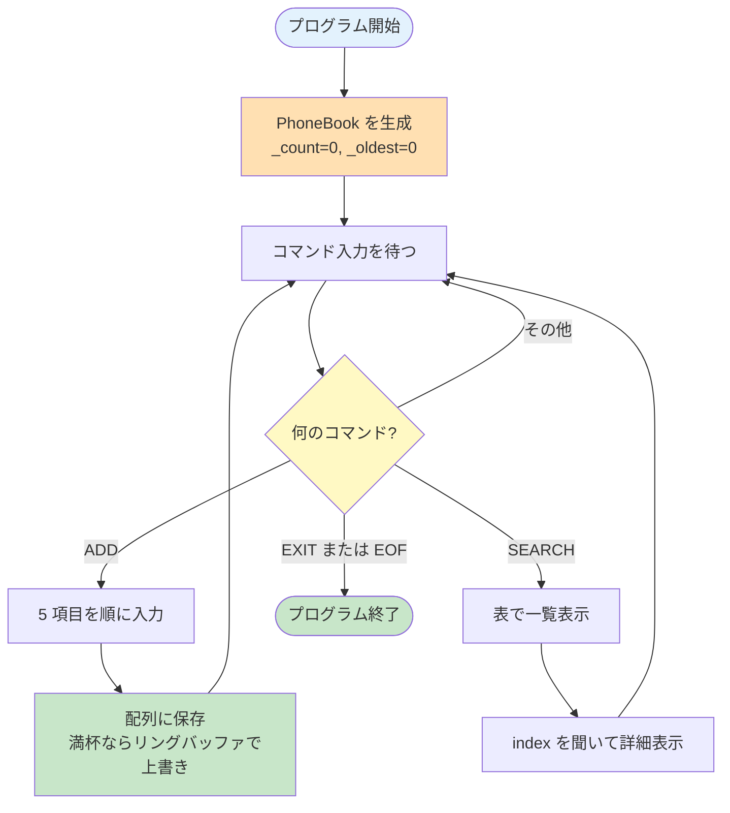

# ex01 — My Awesome PhoneBook

---

## このプログラムは何？

**対話式の電話帳プログラム**です。

コマンドを入力して、連絡先を追加したり検索したりできます。
最大8件まで保存でき、9件目以降は一番古いデータを上書きします。
プログラムを終了すると、保存したデータは全部消えます。

```
ADD    → 連絡先を登録する
SEARCH → 連絡先を表で一覧表示する
EXIT   → プログラムを終了する
```

この exercise は **C++ で初めてクラスを書く** 練習です。

---

## 🎯 なぜこの問題？（学習意図）

42 が cpp00 の中盤にこれを置く理由：

| 学ばせたいこと | この問題で出会う形 |
|---|---|
| **クラスの基本**（class / private / public） | データを `_firstName` のように隠し、setter 経由で書き込ませる |
| **コンストラクタ / デストラクタ** | `PhoneBook` を作っただけで `_count=0` などが自動で揃う体験 |
| **`const` の使いどころ** | 「この getter はオブジェクトを変えません」を関数末尾の `const` で約束する |
| **対話 I/O**（`std::getline`） | スペース込みの 1 行を読む = `>>` だけでは届かない世界 |
| **整形出力**（`<iomanip>`） | 表のカラム幅を揃える「ビュー側」の発想 |

つまり「**C 構造体 + 関数の "ふわっとした連動" を、クラスで "ちゃんと閉じる" 訓練**」が真の狙い。
データを隠す → 出入口を決める → 約束を `const` で固める、という C++ の基本作法をここで一気に獲得します。

---

## 1. このexerciseで学ぶこと

C の構造体 (`struct`) を卒業して、
C++ の**クラス (`class`)**を覚える exercise です。

- **`class`** -- データと関数を1つにまとめる箱
- **コンストラクタ / デストラクタ** -- 自動で呼ばれる特別な関数
- **`private` / `public`** -- 見せる・隠すの仕分け
- **getter / setter** -- private データへの窓口
- **`const`** -- 「変更しません」の約束
- **`std::getline`** -- スペースを含む1行まるごと読む
- **`<iomanip>`** -- 表示を整えるための道具

---

## 2. 新しい概念をひとつずつ解説

### クラス (`class`) って何？

**データと関数を1つの箱にまとめたもの**です。

C では「データを入れる箱 (struct)」と
「それを操作する関数」が**別々の場所**に散らばります。
C++ の `class` は両方を **1つにまとめて** 管理します。

**C の場合（3つの作業が必要）**

1. `struct` でデータの形を定義する
2. データを操作する関数を**別途**書く
3. アクセス制御がないので誰でも中身を書き換え可能

**C++ の場合（1つの class で完結）**

- `class` の中に「データ」と「関数」を両方書く
- `private` / `public` でアクセス制御までできる

=== "C の書き方"

    ```c
    /* printf 用ヘッダ */
    #include <stdio.h>

    /* ── ステップ1: データの形を定義 ── */
    /* typedef struct s_xxx { ... } t_xxx; */
    /* は C でよく使う命名規約 */
    typedef struct s_contact
    {
        /* 名前 (50文字固定の配列) */
        char first_name[50];
        /* 苗字 (50文字固定の配列) */
        char last_name[50];
    } t_contact;

    /* ── ステップ2: 関数を別途定義 ── */
    /* 構造体とは別の場所に書く必要がある */
    /* (struct の中には関数を書けない) */
    void print_contact(t_contact *c)
    {
        /* c->first_name でメンバにアクセス */
        /* (ポインタ経由なので -> を使う) */
        printf("%s %s\n",
            c->first_name,
            c->last_name);
    }

    /* ── 問題点: アクセス制御がない ── */
    /* 誰でも c->first_name を */
    /* 直接書き換えられてしまう */
    ```

=== "C++ の書き方"

    ```cpp
    // cout 用ヘッダ
    #include <iostream>
    // std::string 用ヘッダ
    #include <string>

    // ── データと関数を1つの箱にまとめる ──
    // class: データ+関数+アクセス制御を1つに
    class Contact
    {
    // ── private: 外から触れない ──
    private:
        // std::string = 可変長の文字列
        // (char[50] の進化版、長さ自動調整)
        std::string _firstName;
        std::string _lastName;

    // ── public: 外から使える ──
    public:
        // クラスの中に関数を書ける!
        // const = この関数はメンバを変更しない約束
        void print() const
        {
            // _firstName に直接アクセス可能
            // (同じクラス内なので private でもOK)
            std::cout << _firstName
                      << " "
                      << _lastName
                      << std::endl;
        }
    };

    // ── 利点: アクセス制御で安全性アップ ──
    // 外から c._firstName はコンパイルエラー
    ```

!!! info "メンバ変数の先頭の `_` (アンダースコア) は何？"
    `_firstName` のように **メンバ変数の名前を `_` で始める** のは、**42 のコーディング慣習** で「これはクラスのメンバ変数だよ」という目印です。**C++ の言語仕様ではありません**。

    **なぜ付けるのか:**

    - 引数名 `firstName` とメンバ名 `_firstName` を区別できる (代入時に名前衝突しない)
    - コードを読むときに「これはローカル変数？それともメンバ？」が瞬時にわかる
    - private な変数だとひと目でわかる (公開 API では `getFirstName()` のように `_` なし)

    **使ってはいけないパターン (C++ 標準で予約されている):**

    | 形 | 例 | 理由 |
    |---|---|---|
    | `__name` (先頭ダブル) | `__count` | 処理系予約 |
    | `_Name` (先頭 `_` + 大文字) | `_Count` | グローバル空間で予約 |
    | `_name` (先頭 `_` + 小文字) | `_count` | **メンバ変数なら OK**。グローバル変数では予約と衝突するので避ける |

    つまり **クラスの中のメンバ変数で `_小文字...` を使うのは安全** で、42 ではこれを慣習として採用しています。

### コンストラクタって何？

**オブジェクトが作られたとき、
自動で呼ばれる特別な関数**です。

C の「メモリ確保 + 初期化関数を自分で呼ぶ」という
**2ステップ**を、C++ では**1ステップ**にまとめます。

**C の場合（2ステップ必要）**

1. `malloc` や変数宣言でメモリを用意
2. `init_xxx()` のような初期化関数を**自分で呼ぶ**

**C++ の場合（1ステップ）**

- 変数宣言 or `new` した瞬間にコンストラクタが**自動で呼ばれる**
- 呼び忘れが物理的に不可能

=== "C の書き方（2ステップ）"

    ```c
    /* ── ステップ1: 構造体の変数を宣言 ── */
    /* この時点では中身は未初期化（ゴミ値） */
    t_phonebook book;

    /* ── ステップ2: 初期化関数を自分で呼ぶ ── */
    /* init_phonebook は「自分で作る関数」 */
    /* 中身は例えば: */
    /*   void init_phonebook(t_phonebook *b) { */
    /*       b->count = 0;                    */
    /*       b->oldest = 0;                   */
    /*       memset(b->contacts, 0,           */
    /*              sizeof(b->contacts));     */
    /*   }                                    */
    /* この呼び出しを忘れるとゴミ値のまま */
    init_phonebook(&book);
    ```

=== "C++ の書き方（1ステップ）"

    ```cpp
    class PhoneBook
    {
    public:
        // ── コンストラクタ ──
        // クラス名と同じ名前、戻り値なし
        // new / 変数宣言時に自動で呼ばれる
        PhoneBook()
        {
            // メンバを初期化
            _count = 0;
            _oldest = 0;
            // _contacts[8] は Contact() が
            // 8回自動で呼ばれる (入れ子)
        }
    };

    int main()
    {
        // この1行で:
        //   ①スタック上にメモリ確保
        //   ②コンストラクタが自動で呼ばれる
        //   ③_count, _oldest が 0 に初期化
        PhoneBook book;
        return 0;
    }
    ```

| | C（2ステップ） | C++（1ステップ） |
|---|-------------|-----------------|
| 宣言 | `t_phonebook book;` | `PhoneBook book;` |
| 初期化 | `init_phonebook(&book);` 手動 | **自動で実行** |
| 呼び忘れ | あり得る（バグの元） | 物理的に不可能 |

!!! info "なぜコンストラクタには戻り値がないの？"
    C++ の言語設計上、コンストラクタは「**作ったら必ず成功している**」契約になっています。`int init() { return 0; }` のように戻り値で成功/失敗を返してしまうと、**呼び出し側が戻り値を見ずに `init()` を呼びっぱなしにできてしまい**、未初期化のオブジェクトが流通する原因になります。

    戻り値の概念そのものを言語から排除することで、「コンストラクタが終わった = 必ずオブジェクトは正常状態」という強い保証を作っています。

    (本当に初期化が失敗する状況では **例外** を投げる仕組みを使いますが、cpp03 以降の話題。cpp00 では「コンストラクタは必ず成功する」前提で OK です)。

### デストラクタって何？

**オブジェクトが消えるとき、
自動で呼ばれる特別な関数**です。

C の「片付け関数を呼ぶ + `free`」という
**2ステップ**を、C++ では**1ステップ**にまとめます。

**C の場合（2ステップ必要）**

1. `cleanup_xxx()` のような後片付け関数を自分で呼ぶ
2. `free()` でメモリ解放（ヒープの場合）

**C++ の場合（1ステップ）**

- スコープを抜けた or `delete` された瞬間にデストラクタが**自動で呼ばれる**
- 呼び忘れが物理的に不可能

=== "C の書き方（2ステップ）"

    ```c
    /* ── ステップ1: 後片付け関数を呼ぶ ── */
    /* cleanup_phonebook は「自分で作る関数」 */
    /* 中身は例えば:                        */
    /*   void cleanup_phonebook(            */
    /*           t_phonebook *b) {          */
    /*       if (b->log_file)               */
    /*           fclose(b->log_file);       */
    /*       free(b->contacts_dynamic);     */
    /*   }                                  */
    cleanup_phonebook(&book);

    /* ── ステップ2: メモリを解放 ── */
    /* スタック変数なら不要、ヒープなら必要 */
    /* free(book_ptr); */
    ```

=== "C++ の書き方（1ステップ）"

    ```cpp
    class PhoneBook
    {
    public:
        // ── デストラクタ ──
        // ~ (チルダ) + クラス名
        // スコープ終了 / delete 時に
        // 自動で呼ばれる
        ~PhoneBook()
        {
            // 終了処理を書く場所
            // (今回は空でOK)
            // ファイルを閉じたり free したり
        }
    };

    int main()
    {
        PhoneBook book;
        // ↓ ここで } を抜けるとき、
        //   ~PhoneBook() が自動で呼ばれる
        //   呼び忘れる心配なし!
        return 0;
    }
    ```

| | C（2ステップ） | C++（1ステップ） |
|---|-------------|-----------------|
| 後片付け | `cleanup_xxx(&b);` 手動 | **デストラクタで自動** |
| メモリ解放 | `free(b)` | **スコープ終了で自動** |
| 呼び忘れ | あり得る（リークの元） | 物理的に不可能 |

!!! info "なぜデストラクタはユーザが直接呼ばないの？"
    デストラクタは **オブジェクトが消えるイベント** (スコープ離脱、`delete`、配列要素の解放など) に**自動で紐付いて呼ばれる関数** です。ユーザがコードで `book.~PhoneBook();` と書いて呼ぶことは原則ありません。

    **なぜそうなっている？**

    - **二重解放の防止**: ユーザが手動で呼んで、その後スコープを抜けるとデストラクタが**もう一度**自動で呼ばれて二重解放になる
    - **呼び忘れの防止**: 自動呼び出しなので、ユーザが「忘れた」状況が物理的に作れない
    - **例外発生時も呼ばれる**: スコープ離脱イベントに紐付いているので、関数の途中で例外が飛んでも片付けが行われる (RAII = Resource Acquisition Is Initialization の核心)

    つまりデストラクタの仕事は「**書いておくだけで、呼び出しは言語が責任を持つ**」もので、これが C の `cleanup_xxx()` 関数とは決定的に違う点です。

### `private` と `public` って何？

**`private` は「外から見えない」**、
**`public` は「外から使える」** という意味です。

`private` は鍵のかかった日記帳のようなもの。
中身を見たいなら、決められた方法（getter）を
使わないといけません。

```cpp
class Contact
{
private:
    // 外からは直接触れない
    std::string _firstName;

public:
    // 外から使える窓口
    std::string getFirstName() const
    {
        return _firstName;
    }
};

int main()
{
    Contact c;
    // c._firstName;       // NG! private!
    // c.getFirstName();   // OK! public!
    return 0;
}
```

!!! tip "なぜ private にするの？"
    外から勝手にデータを書き換えられないように
    するためです。

    例えば電話番号を空っぽにされたら困りますよね。
    setter（書き込み窓口）の中で
    「空っぽはダメ！」とチェックできます。

    これを**カプセル化**と呼びます。
    ディフェンスで確実に聞かれるポイントです。

### getter / setter って何？

**getter は「private データを読む窓口」**、
**setter は「private データを書く窓口」** です。

```cpp
class Contact
{
private:
    std::string _firstName;  // 隠れている

public:
    // getter: 読み取り窓口
    std::string getFirstName() const
    {
        return _firstName;
    }

    // setter: 書き込み窓口
    void setFirstName(
        const std::string &value)
    {
        _firstName = value;
    }
};
```

getter は「覗き窓」、setter は「投入口」
というイメージです。

### `const` って何？

**「この関数はデータを変えません」という約束**です。

2つの使い方があります。

```cpp
// (1) const メンバ関数
// 「この関数はメンバ変数を変更しない」
std::string getFirstName() const
{                        // ^^^^^ ここ
    return _firstName;
    // _firstName = "Bob"; // NG! const違反
}

// (2) const 参照引数
// 「この引数は読むだけ、変更しない」
void setFirstName(
    const std::string &value)
{// ^^^^^               ^ 参照（コピーしない）
    _firstName = value;
}
```

!!! info "なぜ `const std::string &` と書くの？"
    - `const` = 変更しないよという約束
    - `&` = コピーせず元のデータを直接見る（速い）

    文字列をまるごとコピーすると遅いので、
    「見るだけだからコピーしないで」と伝えています。

!!! info "なぜ getter には `const` を付けるの？ (const 伝播の理屈)"
    `getFirstName() const` のように **末尾に `const`** を付けないと、**`const Contact c` から呼べない** という言語仕様があります。

    ```cpp
    void show(const Contact &c)   // c は変更しない約束
    {
        // c.getFirstName() を呼びたい
        // → getFirstName() に const が付いていないと
        //   コンパイルエラー!
    }
    ```

    **なぜそうなっている？** const オブジェクトに対して「メンバを書き換えるかもしれない関数」を呼ばせたら const の意味が無くなるので、**const 関数だけが const オブジェクトから呼べる**というルールが言語に組み込まれています。これが `const 伝播` (`const correctness`) の核心です。

    **実用的な意味:**

    - **読むだけの関数 = 必ず `const` を付ける** (将来 `const` 参照渡しされても困らない)
    - **書き換える関数 (setter など) = `const` を付けない**
    - 評価でも「なぜ getter は const ?」はよく聞かれる

### `std::getline` って何？

**1行まるごと読み込む関数**です。

C の `fgets` は「バッファサイズ指定 + 改行も残る」ので、
**改行除去**と**バッファサイズ管理**を自分でやる必要があります。
`std::getline` は**1発で**全部やってくれます。

**C の場合（3ステップ必要）**

1. `char buf[256]` 等で**固定バッファ**を用意（長いと切れる）
2. `fgets` で読み込み（末尾に改行 `\n` が残る）
3. 末尾の改行を自分で消す

**C++ の場合（1ステップ）**

- `std::getline(std::cin, input)` の1行で完了
- バッファサイズも改行除去も**自動**

=== "C の書き方（3ステップ）"

    ```c
    /* strlen を使うためのヘッダ */
    #include <string.h>
    /* fgets を使うためのヘッダ */
    #include <stdio.h>

    /* ── ステップ1: 固定バッファを用意 ── */
    /* 256 文字を超える入力は切られる */
    char buf[256];

    /* ── ステップ2: fgets で読む ── */
    /* fgets: 標準入力から1行読む C 関数 */
    /* 引数: 読み込み先、最大サイズ、入力元 */
    /* 改行文字 '\n' も buf に残る */
    fgets(buf, 256, stdin);

    /* ── ステップ3: 改行を手動で消す ── */
    /* strlen: 文字列の長さを返す C 関数 */
    /* buf[長さ-1] が '\n' なのでそこを '\0' に */
    buf[strlen(buf) - 1] = '\0';
    ```

=== "C++ の書き方（1ステップ）"

    ```cpp
    // std::string の空文字列で初期化
    std::string input;

    // ── この1行で全部やってくれる ──
    //   ①標準入力から1行読む (fgets 相当)
    //   ②改行を自動で除去
    //   ③入力長に応じて std::string が自動拡張
    //     (バッファオーバーフロー不可能)
    std::getline(std::cin, input);
    ```

```cpp
// cin >> だとスペースで切れる
std::cin >> input;
// 入力: "Alice Liddell"
// input: "Alice" だけ！

// getline ならスペースも読める
std::getline(std::cin, input);
// 入力: "Alice Liddell"
// input: "Alice Liddell" 全部！
```

!!! danger "`>>` と `getline` を混ぜないこと"
    `>>` は改行文字を残すので、
    次の `getline` が空行を読んでしまいます。
    対話プログラムでは `getline` だけ使いましょう。

---

## 3. 課題仕様

| 項目 | 内容 |
|------|------|
| プログラム名 | `phonebook` |
| クラス | `Contact` と `PhoneBook` の2つ |
| コマンド | `ADD`, `SEARCH`, `EXIT` |
| 最大件数 | 8件（固定配列、動的確保禁止） |
| 9件目以降 | 最古の連絡先を上書き |
| Makefile | `all`, `clean`, `fclean`, `re` |

---

## 4. 実行例

```console
$ make
$ ./phonebook
Enter command (ADD, SEARCH, EXIT): ADD
First name: Alice
Last name: Liddell
Nickname: alice
Phone number: 0901234567
Darkest secret: rabbit hole
Contact added.
Enter command (ADD, SEARCH, EXIT): ADD
First name: Bob
Last name: TheVeryLongLastName
Nickname: bob
Phone number: 0907654321
Darkest secret: -
Contact added.
Enter command (ADD, SEARCH, EXIT): SEARCH
     index|first name| last name|  nickname
         0|     Alice|   Liddell|     alice
         1|       Bob|TheVeryLo.|       bob
Enter index: 0
First name: Alice
Last name: Liddell
Nickname: alice
Phone number: 0901234567
Darkest secret: rabbit hole
Enter command (ADD, SEARCH, EXIT): EXIT
$
```

`TheVeryLongLastName` は19文字なので、
表では `TheVeryLo.`（9文字 + `.`）に切り詰められます。
詳細表示では全文字が表示されます。

---

## 5. コード解説

### プログラムの流れ



### ファイル構成

```
ex01/
 +-- Contact.hpp    # Contact クラス宣言
 +-- Contact.cpp    # Contact クラス実装
 +-- PhoneBook.hpp  # PhoneBook クラス宣言
 +-- PhoneBook.cpp  # PhoneBook クラス実装
 +-- main.cpp       # 対話ループ
 +-- Makefile
```

### なぜ `.hpp` と `.cpp` に分けるの？

**1 行で言うと:** 「クラスの形 (宣言)」と「中身のコード (実装)」を別ファイルに分けて、コンパイルの効率と保守性を上げるためです。

**C の場合 (.h と .c の分離)**

C でも普段から `.h` と `.c` を分けてきたはずです。理由は同じ:

1. ヘッダ `.h` には型・関数の**宣言**だけ書く
2. 実装 `.c` に関数の中身を書く
3. 他の `.c` は `#include "header.h"` だけして、宣言を見て関数を呼ぶ

**C++ の場合 (.hpp と .cpp)**

C++ でも全く同じ流儀。ファイルの拡張子が `.hpp`/`.cpp` (または `.h`/`.cpp`) になるだけです。クラス宣言を `.hpp` に、メンバ関数の実装を `.cpp` に書きます。

**なぜこの仕様？**

- **コンパイル時間の短縮**: 1 つの `.cpp` を直しても、再コンパイルされるのはその `.cpp` 1 つだけ。実装をヘッダに書くと、そのヘッダを include しているすべての `.cpp` が再コンパイルされる
- **二重定義エラー回避**: ヘッダに関数の実体を書くと、複数の `.cpp` がそれを include した時、**同じ関数の実体がプログラム内に複数できてしまい**、リンクエラーになる。宣言だけなら何度 include されても OK
- **配布の柔軟性**: ライブラリ作者は `.hpp` だけ公開し、`.cpp` をコンパイル済みオブジェクトファイル (`.o`) で配布できる

**使いどころ:**

- **クラスごとに `.hpp` + `.cpp` のペア** を作るのが基本 (例: `Contact.hpp` + `Contact.cpp`)
- 例外: **テンプレート関数・テンプレートクラス** はヘッダに実装ごと書く必要がある (cpp00 では使わない)
- 例外: **inline 関数** もヘッダに書ける (cpp00 では出てこない)

| 役割 | C | C++ |
|---|---|---|
| 宣言を書く場所 | `.h` | `.hpp` (or `.h`) |
| 実装を書く場所 | `.c` | `.cpp` |
| インクルード | `#include "header.h"` | `#include "header.hpp"` |
| 多重 include 防止 | include guard | include guard (下記) |

!!! info "`#ifndef ... #define ... #endif` の役目 = インクルードガード"
    ヘッダの先頭と末尾にある以下のおまじないが**インクルードガード**:

    ```cpp
    #ifndef CONTACT_HPP   // もし CONTACT_HPP がまだ未定義なら
    #define CONTACT_HPP   // 定義しておいて
    // ...クラス宣言...
    #endif                // ここまでが #ifndef の範囲
    ```

    **なぜ必要？**

    `main.cpp` が `PhoneBook.hpp` を include し、`PhoneBook.hpp` が内部で `Contact.hpp` を include していると、ある `.cpp` のコンパイル中に `Contact.hpp` が **複数回読まれる** ことがあります (推移的 include)。2 回読まれると `class Contact { ... };` の宣言が 2 回現れて**重複定義エラー**になります。

    インクルードガードは「2 回目以降のロードはスキップ」させる仕組みで、これを防ぎます。

    **マクロ名の慣習:** ファイル名を全部大文字にして `_` で繋ぐ (`CONTACT_HPP`, `PHONE_BOOK_HPP`)。プロジェクト内で衝突しないように。

    **`#pragma once` という代替もあるけど?** モダンコンパイラの大半が対応していますが、**C++98 標準には含まれない非標準拡張** なので、42 では `#ifndef` 方式を使います。

### 5.1 `Contact.hpp` -- 連絡先1件のクラス

```cpp title="Contact.hpp" linenums="1"
// ── インクルードガード ──
// 同じヘッダを2回読み込まないようにする
#ifndef CONTACT_HPP
#define CONTACT_HPP

#include <string>

class Contact
{
// ── private: 外から直接触れないデータ ──
private:
    // 先頭の _ は「private だよ」の印
    // 42 の慣習（ルールではない）
    std::string _firstName;
    std::string _lastName;
    std::string _nickname;
    std::string _phoneNumber;
    std::string _darkestSecret;

// ── public: 外から使える関数 ──
public:
    // コンストラクタ（作るとき自動で呼ばれる）
    Contact();
    // デストラクタ（消えるとき自動で呼ばれる）
    ~Contact();

    // getter: 読み取り窓口
    // 末尾の const = 「変更しません」の約束
    std::string getFirstName() const;
    std::string getLastName() const;
    std::string getNickname() const;
    std::string getPhoneNumber() const;
    std::string getDarkestSecret() const;

    // setter: 書き込み窓口
    // const std::string & = コピーしない参照渡し
    void setFirstName(
        const std::string &value);
    void setLastName(
        const std::string &value);
    void setNickname(
        const std::string &value);
    void setPhoneNumber(
        const std::string &value);
    void setDarkestSecret(
        const std::string &value);

    // 空かどうか判定する関数
    bool isEmpty() const;
};

#endif
```

### 5.2 `Contact.cpp` -- Contact の実装

!!! info "`Contact::` の `::` は何？ — スコープ解決演算子"
    実装ファイルでは `Contact::Contact()` `Contact::getFirstName()` のように、関数名の前に **`Contact::`** が付きます。これは「**この関数は Contact クラスのものですよ**」と明示する記法です。

    `::` は **スコープ解決演算子** といい、`std::cout` の `std::` と**同じ仕組み**です:

    | 書き方 | 意味 |
    |---|---|
    | `std::cout` | `std` 名前空間の中の `cout` |
    | `Contact::Contact()` | `Contact` クラスの中の `Contact` (コンストラクタ) |
    | `Contact::getFirstName()` | `Contact` クラスの中の `getFirstName` メソッド |
    | `Account::getNbAccounts()` | `Account` クラスの static メソッド (cpp00 ex02 で登場) |

    **なぜ必要？** 異なるクラスに同じ名前のメソッドがあっても、`Contact::print` と `PhoneBook::print` は別物として区別できる。namespace と同じ「住所付け」の発想です。

```cpp title="Contact.cpp" linenums="1"
#include "Contact.hpp"

// コンストラクタ（中身は空でOK）
// std::string は自動で "" に初期化される
Contact::Contact() {}

// デストラクタ（中身は空でOK）
Contact::~Contact() {}

// ── getter（5つとも同じパターン）──
std::string Contact::getFirstName() const
{
    return _firstName;
}

std::string Contact::getLastName() const
{
    return _lastName;
}

std::string Contact::getNickname() const
{
    return _nickname;
}

std::string Contact::getPhoneNumber() const
{
    return _phoneNumber;
}

std::string Contact::getDarkestSecret() const
{
    return _darkestSecret;
}

// ── setter（5つとも同じパターン）──
void Contact::setFirstName(
    const std::string &value)
{
    _firstName = value;
}

void Contact::setLastName(
    const std::string &value)
{
    _lastName = value;
}

void Contact::setNickname(
    const std::string &value)
{
    _nickname = value;
}

void Contact::setPhoneNumber(
    const std::string &value)
{
    _phoneNumber = value;
}

void Contact::setDarkestSecret(
    const std::string &value)
{
    _darkestSecret = value;
}

// 名前が空なら「空の連絡先」と判定
bool Contact::isEmpty() const
{
    return _firstName.empty();
}
```

!!! note "`Contact::getFirstName()` の `Contact::` って何？"
    「Contact クラスに属する getFirstName 関数」
    という意味です。

    `.hpp` で宣言した関数を `.cpp` で定義するとき、
    **どのクラスの関数か** を `クラス名::` で示します。

### 5.3 `PhoneBook.hpp` -- 電話帳クラス

```cpp title="PhoneBook.hpp" linenums="1"
#ifndef PHONEBOOK_HPP
#define PHONEBOOK_HPP

#include "Contact.hpp"

class PhoneBook
{
private:
    // Contact が8個入る固定配列
    // 各 Contact のコンストラクタが
    // 自動で呼ばれる
    Contact _contacts[8];
    // 今何件入っているか
    int     _count;
    // リングバッファの上書き位置
    int     _oldest;

    // private ヘルパー関数
    // （外から呼ぶ必要がないので隠す）
    std::string _truncate(
        const std::string &str) const;
    void        _displayRow(
        int index,
        const Contact &contact) const;

public:
    // コンストラクタ / デストラクタ
    PhoneBook();
    ~PhoneBook();

    // 外から使う機能
    void addContact(
        const Contact &contact);
    void searchContacts() const;
    void displayContact(int index) const;
    int  getCount() const;
};

#endif
```

### 5.4 `PhoneBook.cpp` -- 実装のポイント

#### (a) メンバ初期化子リスト

コンストラクタで `:` の後ろに書く初期化方法です。

```cpp
// : の後ろで初期化する
PhoneBook::PhoneBook()
    : _count(0), _oldest(0)
{
    // 本体に入る前に初期化が終わっている
    // _contacts[8] は Contact() が
    // 8回自動で呼ばれるので書かなくてOK
}
```

!!! info "なぜ本体で `_count = 0` と書かないの？"
    どちらでも動きますが、
    初期化子リストの方が**効率が良い**です。

    本体の `=` は「一度作ってから上書き」ですが、
    初期化子リストは「最初からその値で作る」です。

!!! warning "`const` メンバ・参照メンバは **初期化子リスト必須**"
    これは「効率」の話ではなく **言語仕様** です。

    ```cpp
    class Foo {
        const int _maxCount;     // const メンバ
        std::string &_nameRef;   // 参照メンバ
    public:
        Foo(int n, std::string &s)
            : _maxCount(n),       // ← OK
              _nameRef(s)         // ← OK
        {
            // _maxCount = n;     // ✗ const は代入禁止
            // _nameRef = s;      // ✗ 参照は再代入の概念がない
        }
    };
    ```

    **なぜ？**

    - **const メンバ**: 「初期化後は変更禁止」が約束。本体に入った時点で既にメンバ領域は確保済みで、本体の `=` は「代入 (上書き)」になる。const に上書きはできないので、初期化リストでしか値を入れられない
    - **参照メンバ**: 参照は「別名」であり、宣言時に「誰の別名か」を確定させなければならない。本体の `=` は別名先のオブジェクトに代入してしまう (再代入ではない) ので、参照メンバ自体の初期化にならない

    どちらも「**メンバ領域が物理的に確保されるタイミング = 初期化リストが評価されるタイミング**」がポイントです。本体に入った時点では遅い。

    cpp01 ex03 の `Weapon` への参照メンバや、cpp03 の継承で再登場するので、ここで覚えておくと後が楽です。

#### (b) 切り詰め関数

10文字を超える文字列を「9文字 + `.`」にする関数です。

```cpp
std::string PhoneBook::_truncate(
    const std::string &str) const
{
    // 10文字「超」なら切り詰め
    // ちょうど10文字はそのまま
    if (str.length() > 10)
        return str.substr(0, 9) + ".";
    return str;
}
```

- `.substr(0, 9)` -- 先頭9文字を取り出す
- `+ "."` -- 文字列の連結
    （C の `strcat` と違い、あふれる心配なし）

!!! warning "`> 10` であって `>= 10` ではない"
    subject は "longer than 10" と書いてあるので、
    ちょうど10文字はそのまま表示します。

#### (c) `<iomanip>` による表の整形

=== "C の書き方"

    ```c
    /* snprintf 用のヘッダ */
    #include <stdio.h>

    /* ── バッファを用意 ── */
    /* 256文字固定、溢れたら切り捨て */
    char buf[256];

    /* ── snprintf で整形 ── */
    /* snprintf: 文字列を整形してバッファに入れる */
    /* 引数: 出力先、最大サイズ、書式、値 */
    /* %10s = 幅10、右寄せで文字列を入れる */
    snprintf(buf, 256,
        "%10s|%10s|", name1, name2);

    /* ── 画面に出力 ── */
    /* printf: C の標準出力関数 */
    printf("%s\n", buf);
    ```

=== "C++ の書き方"

    ```cpp
    // setw / right を使うためのヘッダ
    #include <iomanip>

    // setw(10) = 次の出力を幅10で表示
    //           (printf の %10s と同じ効果)
    // right    = 右寄せ指定
    std::cout
        << std::setw(10)  // 幅10を指定
        << std::right     // 右寄せ
        << name1          // 1つ目の値
        << "|"            // 区切り文字
        << std::setw(10)  // 再び幅10
        << std::right     // 再び右寄せ
        << name2          // 2つ目の値
        << "|"            // 区切り文字
        << std::endl;     // 改行+フラッシュ
    ```

| マニピュレータ | 効果 |
|---|---|
| `std::setw(N)` | 次の出力を幅Nで表示 |
| `std::right` | 右寄せ |
| `std::left` | 左寄せ |

!!! warning "`setw` は1回しか効かない"
    `setw(10)` は **次の `<<` 1回だけ** に適用されます。
    列ごとに毎回書き直す必要があります。

    ```cpp
    // NG: a だけ幅10、b と c は幅なし
    std::cout << std::setw(10)
              << a << b << c;

    // OK: 全部に幅10
    std::cout << std::setw(10) << a
              << std::setw(10) << b
              << std::setw(10) << c;
    ```

### 5.5 `main.cpp` -- 対話ループ

```cpp title="main.cpp" linenums="1"
#include "PhoneBook.hpp"
#include <iostream>

// 空入力を許さず再入力させるヘルパー
// static = このファイル内でだけ使える
static std::string readField(
    const std::string &prompt)
{
    std::string input;

    while (true)
    {
        std::cout << prompt;
        // getline で1行読む
        // EOF(Ctrl+D) なら空文字を返す
        if (!std::getline(std::cin, input))
            return "";
        // 空でなければ OK
        if (!input.empty())
            return input;
        std::cout
            << "Field cannot be empty."
            << std::endl;
    }
}

int main(void)
{
    // PhoneBook オブジェクトをスタック上に生成
    // → コンストラクタが自動で走る
    PhoneBook   book;
    std::string command;

    while (true)
    {
        std::cout
            << "Enter command "
            << "(ADD, SEARCH, EXIT): ";

        // 1行読む（EOF なら抜ける）
        if (!std::getline(
                std::cin, command))
            break;

        // std::string は == で比較できる
        // strcmp は不要！
        if (command == "ADD")
            doAdd(book);
        else if (command == "SEARCH")
            doSearch(book);
        else if (command == "EXIT")
            break;
        // それ以外は無視してループに戻る
    }
    // } を抜けると book のデストラクタが
    // 自動で呼ばれる
    return 0;
}
```

!!! info "なぜ動的メモリ確保を使わないの？"
    subject で「最大8件」と決まっているので、
    `Contact _contacts[8]` の固定長配列で十分です。

    `new` / `delete` を使う必要がなく、
    メモリリークの心配もありません。

    9件目以降はリングバッファ方式で対応します。

    ```cpp
    // リングバッファ: 周回するインデックス
    // 0 → 1 → 2 ... → 7 → 0 に戻る
    _oldest = (_oldest + 1) % 8;
    ```

---

## 6. テストチェックリスト

### 評価シートの確認項目

!!! note "評価シート原文"
    > "Beginners tend to make everything public.
    > That's what you need to check here."

    「なぜ private にしたのか」は**確実に聞かれます**。
    カプセル化を説明できるようにしておきましょう。

!!! note "評価シート原文"
    > "A slight deviation from the expected format
    > is not important. This part is about
    > using iomanips in C++."

    フォーマットの多少のずれは減点されにくいです。
    **iomanip を使っていることが重要**です。

### 基本動作

- [ ] `make` が警告なく通る
- [ ] `ADD` → 5フィールド入力 → 登録される
- [ ] `SEARCH` で登録済みの連絡先が表で表示される
- [ ] 各列が幅10、右寄せ、`|` 区切り
- [ ] `EXIT` で終了
- [ ] 未知のコマンド (`foo`) は無視される

### 空入力のハンドリング

- [ ] `First name:` で Enter → 再入力を要求
- [ ] すべてのフィールドで同様
- [ ] 空の状態で `SEARCH` → エラーメッセージ
- [ ] `Ctrl+D`（EOF）で安全に終了、segfault しない

### 表示フォーマット

- [ ] 10文字ぴったり → そのまま表示
- [ ] 10文字未満 → 右寄せ（左に空白）
- [ ] 11文字以上 → 9文字 + `.` に切り詰め
- [ ] `SEARCH` 後に `Enter index:` プロンプト
- [ ] 範囲外の数字 → `Invalid index.`

### 8件上限とリングバッファ

- [ ] 8件登録 → `SEARCH` で8件表示
- [ ] 9件目追加 → 最古（index 0）が上書きされる
- [ ] 10件目追加 → index 1 が上書きされる

### 詳細表示

- [ ] 10文字超の名前も詳細では全文字表示
- [ ] 全5フィールドが正しく表示される

### 規約

- [ ] クラスは `Contact` と `PhoneBook` の2つ
- [ ] 動的メモリ確保 (`new`, `malloc`) 不使用
- [ ] `printf` / `scanf` 等 C 関数を使っていない
- [ ] `using namespace std;` なし
- [ ] getter に `const` が付いている
- [ ] メンバ変数がすべて `private`
- [ ] 各 `.hpp` にインクルードガード
- [ ] ヘッダに関数の実装を書いていない

---

## 7. ディフェンスで聞かれること

| 質問 | 答え方 | 実装で言うと |
|------|--------|-------------|
| なぜメンバ変数を private にした？ | **カプセル化**のため。直接書き換えを禁止し、setter 経由で必ずバリデーションを通す | `Contact.hpp` の `_firstName` 等は全て `private:` 配下。setter は `Contact::set*` で空文字チェック等を行う |
| `private` と `public` の違いは？ | `private` はクラス外からアクセス不可。データは `private`、操作は `public` の getter / setter | `Contact.hpp`: データ `_xxx` は private、`get*` / `set*` は public |
| getter に `const` を付ける理由は？ | 「メンバを変更しません」の約束。`const Contact&` からも呼べるようにするため | `Contact.hpp` の `getFirstName() const;` のように関数末尾に `const` |
| `const std::string&` の `&` は何？ | 参照渡し。コピーを作らず元データを直接読む。`const` で「変更しない」と約束 | `Contact::setFirstName(const std::string& v)` で文字列を高速に受け取る |
| `std::getline` と `std::cin >>` の違いは？ | `getline` はスペース込みの 1 行全部。`>>` は空白区切り + 改行残し | `main.cpp` で全入力を `std::getline(std::cin, line)` で読む。`>>` は混ぜない |
| `setw` の注意点は？ | **直後の `<<` 1 回だけ** に効く。列ごとに毎回書き直し | `PhoneBook.cpp` の表表示で各カラム前に `std::setw(10)` を 1 回ずつ呼ぶ |
| 動的メモリを使わない理由は？ | 最大 8 件で固定。`new` / `delete` 不要 → リーク発生不可能 | `PhoneBook.hpp` で `Contact _contacts[8];` の生配列。ヒープ未使用 |
| 9 件目以降はどうなる？ | リングバッファで最古を上書き。`_oldest = (_oldest + 1) % 8` で周回 | `PhoneBook::add` 内で `_count == 8` 時に `_oldest` をインクリメント |
| コンストラクタとは何か？ | 生成時に自動で呼ばれる初期化関数。クラス名と同じ名前で戻り値なし | `PhoneBook::PhoneBook() : _count(0), _oldest(0) {}` でメンバ初期化子リストを使用 |
| デストラクタとは何か？ | 破棄時に自動で呼ばれる関数。`~クラス名`。リソース解放に使う | `~PhoneBook() {}` / `~Contact() {}`。今回は空。動的確保がないため |

---

## 8. よくあるミス

!!! warning "`std::cin >>` で読むとハマる"
    ```cpp
    // NG: スペースで切れる、改行が残る
    std::cin >> command;

    // OK: 1行まるごと読む
    std::getline(std::cin, command);
    ```
    対話プログラムでは `>>` と `getline` を
    混ぜないこと。改行が残って謎の動作になります。

!!! warning "`setw` は1回しか効かない"
    ```cpp
    // NG: a だけ幅10
    std::cout << std::setw(10)
              << a << b << c;

    // OK: 全部に幅10
    std::cout << std::setw(10) << a
              << std::setw(10) << b
              << std::setw(10) << c;
    ```

!!! warning "切り詰め判定は10文字「超」"
    subject は "longer than 10" なので、
    **ちょうど10文字はそのまま**表示します。

    ```cpp
    // OK: > 10（11文字以上で切り詰め）
    if (str.length() > 10)

    // NG: >= 10（10文字も切り詰めてしまう）
    if (str.length() >= 10)
    ```

!!! warning "リングバッファのインデックス計算ミス"
    ```cpp
    // OK: 0→1→...→7→0 と周回
    _oldest = (_oldest + 1) % 8;

    // NG: 8を超えると配列外アクセス
    _oldest++;
    ```

!!! warning "getter の戻り値とコピー"
    ```cpp
    // 参照を返す（コピーなしで速い）
    const std::string& getFirstName() const;

    // 値を返す（コピーする）
    std::string getFirstName() const;
    ```
    42 的にはどちらでも OK ですが、
    参照を返す方が効率的です。

---

## 💡 ここまでの学びのまとめ

このページで身についたこと:

- **`class` でデータと関数を 1 つにまとめる**（C の構造体 + 関数の進化版）
- **`private` でデータを隠し、`public` の setter / getter で出入口を作る**（カプセル化）
- **コンストラクタ / デストラクタ** が「自動で呼ばれる初期化・後始末」
- **メンバ初期化子リスト** (`: _count(0)`) で「代入」ではなく「初期化」
- **`const` 末尾** で「変更しない」を関数の型レベルで約束する
- **`std::getline` / `<iomanip>` / `setw`** で対話 I/O と整形出力

!!! tip "ここで詰まったら"
    - 「private なのに setter でセットできる？」→ setter は **クラスの中** なので OK
    - 「getter の `const` を消したら？」→ `const PhoneBook&` から呼べなくなる
    - 「`std::cin >>` と `getline` を混ぜると謎の動作」→ `>>` 後の改行が残り、次の `getline` が空文字を返す

cpp00 の山場はここ。次の [ex02 Account](ex02-account.md) では
**`static` メンバ**で「クラスに 1 個だけ存在する変数」を覚えます。

---

## 9. 次の exercise へ

次の [ex02 Account](ex02-account.md) では、
**`static` メンバ**を学びます。

`static` とは「全オブジェクトで共有されるデータ」
のこと。銀行口座の「合計残高」「総口座数」のように、
クラス全体で1つだけ存在する値を管理します。
