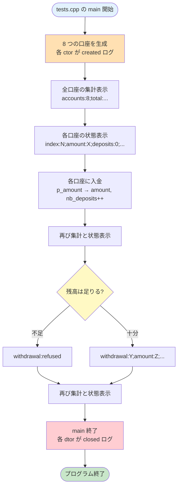

# ex02 — The Job Of Your Dreams (任意)

---

## このプログラムは何？

**銀行口座のシミュレーションプログラム**です。

8つの銀行口座を作って、お金を預けたり引き出したりします。
全ての操作がログ（記録）として画面に出力されます。
このログが、用意されたお手本ログと一致すれば合格です。

```
[20260418_103045] index:0;amount:42;created
[20260418_103045] index:0;p_amount:42;deposit:5;amount:47;nb_deposits:1
[20260418_103045] index:0;p_amount:47;withdrawal:refused
[20260418_103045] index:0;amount:47;closed
```

この exercise の特徴は、**ヘッダファイルだけが渡される**こと。
`.cpp` の中身を自分で推理して書く、ちょっと変わった課題です。

---

## 🎯 なぜこの問題？（学習意図）

42 が cpp00 の最後（しかも任意）にこれを置く理由：

| 学ばせたいこと | この問題で出会う形 |
|---|---|
| **`static` メンバ変数** | 全口座で共有する `_nbAccounts` `_totalAmount` などの「クラスに 1 個」 |
| **`static` メンバ関数** | インスタンスなしで呼べる `Account::displayAccountsInfos()` |
| **コンストラクタ / デストラクタの追跡** | `[timestamp] index:N;amount:42;created` のログを「一致させる」テスト体験 |
| **ヘッダから実装を逆算** | `.hpp` だけを渡されて `.cpp` を書く = 「型シグネチャを読み解く」訓練 |
| **テスト駆動の感覚** | 期待出力（テスタログ）との `diff` ゼロを目指すワークフロー |

つまり「**インスタンスを跨いで状態を共有する仕組み**を、ヘッダ + ログだけから読み解いて実装する」のが真の狙い。
任意課題ですが、**static の理解は cpp02 以降で何度も登場する** ので、ここで体感しておく価値が高いです。

---

## 1. このexerciseで学ぶこと

お手本のヘッダ (`Account.hpp`) とログファイルだけを頼りに、
実装 (`Account.cpp`) を自分で書く exercise です。

- **`static` メンバ変数** -- 全オブジェクトで共有するデータ
- **`static` メンバ関数** -- オブジェクトなしで呼べる関数
- **`typedef`** -- 型に別名を付ける
- **メンバ初期化子リスト** -- コンストラクタでの初期化方法
- **ログ出力の正確な再現** -- セミコロン区切り

---

## 2. 新しい概念をひとつずつ解説

### `static` メンバ変数って何？

**クラス全体で1つだけ存在する共有データ**です。

C でいう **グローバル変数** と同じ仕組みですが、
**クラスの中に隠す**ことでスコープを限定します。

C だと「どこからでも触れる」グローバル変数でしたが、
C++ では「クラスの `private` に隠せる」ので安全です。

=== "C の書き方（グローバル変数）"

    ```c
    /* ── ファイルのトップレベルに書く ── */
    /* ファイル外からも extern で触れる */
    /* 名前の衝突リスクがある           */
    static int g_nb_accounts = 0;
    static int g_total_amount = 0;

    /* 構造体には含まれない          */
    /* (別のグローバル空間に存在)    */
    typedef struct s_account {
        int amount;  /* 各口座の残高 */
    } t_account;

    /* 使う側                        */
    void make_account(int initial) {
        g_nb_accounts++;           /* 共有変数を更新 */
        g_total_amount += initial;
    }
    ```

=== "C++ の書き方（static メンバ）"

    ```cpp
    class Account
    {
    // ── private: 外から直接触れない ──
    private:
        // 普通のメンバ: オブジェクトごとに別
        int _amount;       // 各口座の残高

        // static メンバ: クラス全体で1つ
        // (C のグローバル変数と同じ仕組み、
        //  でもクラス内に隠されている)
        static int _nbAccounts;   // 全口座数
        static int _totalAmount;  // 全口座合計
    };
    ```

教室に例えると分かりやすいです。

- 普通のメンバ変数 = 各生徒のノート（個人持ち）
- `static` メンバ変数 = 教室の黒板（みんなで共有）

図で見るとこうなります。

```
+--------- Account クラス ---------+
|                                   |
|  static _nbAccounts = 3  (共有)  |
|  static _totalAmount = 153 (共有)|
|                                   |
|  +-- 口座0 --+  +-- 口座1 --+   |
|  | _amount:42|  | _amount:54|   |
|  +-----------+  +-----------+   |
|                                   |
|  +-- 口座2 ---+                  |
|  | _amount:57 |                  |
|  +------------+                  |
+-----------------------------------+
```

**「A も B も同じ値を見る」のミニ実例:**

```cpp
Account a(100);   // _nbAccounts: 0 → 1
Account b(200);   // _nbAccounts: 1 → 2
// a も b も同じ _nbAccounts を見ている
// a._nbAccounts は 2、b._nbAccounts も 2
```

`a` のオブジェクトでカウントを増やすと、`b` から見ても増えています。**「全員で 1 つの黒板を共有している」**のがイメージできれば OK です。

**使いどころ:**

- 全インスタンスで共有すべき値: **総数**, **総合計**, **連番 ID 発行**, **シングルトン的な状態**
- 例: 「現在の口座数」「これまでの取引総数」「最後に発行されたチケット番号」
- **逆に使わない**: 各オブジェクト固有の値 (例: 個別の残高、名前、座標) — これらは普通のメンバ変数

**グローバル変数 vs static メンバ — どう違う？**

| | C のグローバル変数 | C++ の `private static` メンバ |
|---|---|---|
| アクセス範囲 | 全ファイルから (`extern` で他から触れる) | クラス内のメソッドだけ |
| 名前衝突 | 起きやすい (`g_count` などの命名規則で対処) | クラス名で隔離されるので衝突しない |
| カプセル化 | できない (誰でも書き換え可能) | private にできて、setter/getter 経由で制御 |
| 関連づけ | 「どのデータと一緒か」がコードを読まないと分からない | クラスの中にあるので**一目瞭然** |

つまり static メンバは「**グローバル変数 + クラスのカプセル化**」の合わせ技です。

!!! danger "static 変数は .cpp で実体を定義する"
    ヘッダで `static int _nbAccounts;` と書くのは
    **宣言**だけです。

    `.cpp` ファイルの先頭で**実体**を定義しないと
    リンカエラーになります。

    ```cpp
    // Account.cpp の先頭に書く（必須！）
    int Account::_nbAccounts = 0;
    int Account::_totalAmount = 0;
    int Account::_totalNbDeposits = 0;
    int Account::_totalNbWithdrawals = 0;
    ```

    ```
    // 忘れるとこのエラーが出る
    Undefined symbols:
      Account::_nbAccounts
    ```

    **なぜ `.cpp` に書く？ なぜヘッダではダメ？**

    ヘッダファイルは **いろんな `.cpp` から `#include` される** ので、ヘッダに `int Account::_nbAccounts = 0;` と書くと、**それを include しているすべての `.cpp` ファイルに同じ実体が複製される**ことになります。

    ```
    main.cpp     → include Account.hpp → 実体ができる (1 つ目)
    Account.cpp  → include Account.hpp → 実体ができる (2 つ目)
    tests.cpp    → include Account.hpp → 実体ができる (3 つ目)
    ```

    リンカが「同じ名前の実体が 3 つある！どれが本物？」と困って **重複定義エラー (ODR 違反)** になります。なので「**宣言はヘッダ、実体は 1 つの `.cpp` に 1 回だけ**」という分担にします。

    **コンパイルとリンクの 2 段階:**

    `Undefined symbols: Account::_nbAccounts` というエラーは「**コンパイル**は通ったが**リンク**で失敗した」状態です。

    1. **コンパイル**: 各 `.cpp` を機械語のオブジェクトファイル (`.o`) に翻訳。この段階ではヘッダの宣言だけ見えれば OK
    2. **リンク**: 全 `.o` を 1 つのバイナリにつなげる。この段階で「`_nbAccounts` の実体はどこ？」を探す。**実体が見つからない**と Undefined symbols エラー

    `static int _nbAccounts;` の宣言は「**この変数は別の場所に存在しますよ**」という約束を書いているだけなので、別の場所 (= どれか 1 つの `.cpp`) に実体がないと約束が守れない、というイメージです。

### `static` メンバ関数って何？

**オブジェクトを作らなくても呼べる関数**です。

普通の関数は `口座a.getAmount()` のように
オブジェクトを指定して呼びますが、
static 関数は `Account::getNbAccounts()` のように
**クラス名だけで呼べます**。

```cpp
// static メンバ関数
// オブジェクトなしで呼べる
int count = Account::getNbAccounts();

// 普通のメンバ関数
// オブジェクトが必要
Account a(100);
int amount = a.checkAmount();
```

**使いどころ:**

- **全インスタンスを横断する集計**: 「合計口座数」「総取引額」など、特定の口座 (オブジェクト) に紐付かない情報の取得
- **ファクトリー関数 (工場関数)**: `Account::createFromFile()` のように「これから作るためのもの」 — まだオブジェクトがないので普通のメソッドにできない
- **ユーティリティ関数のグループ化**: 関連するヘルパー関数をクラスにまとめる名前空間的な使い方
- **ログ・タイムスタンプ出力**: この exercise の `_displayTimestamp()` のように「全口座共通の補助動作」

**逆に使わない場面:**

- 各オブジェクトの状態を読み書きする処理 (`a.getAmount()` のような) — これは普通のメンバ関数

!!! warning "static 関数から普通のメンバにはアクセスできない"
    static 関数は `this` ポインタを持たないので、
    普通のメンバ変数には触れません。

    ```cpp
    // NG: static 関数から普通のメンバにアクセス
    static void foo()
    {
        _amount = 0;  // コンパイルエラー!
    }

    // OK: static 関数から static メンバにアクセス
    static int getNbAccounts()
    {
        return _nbAccounts;  // OK!
    }
    ```

    **なぜ this が無いの？**

    普通のメンバ関数 `a.checkAmount()` は、内部で**暗黙の引数 `this`** が渡されています:

    ```cpp
    // 内部的にはこう書かれているのと同じ
    int Account::checkAmount(Account *this) {
        return this->_amount;
        //     ^^^^^^^^^^^^ どの口座の残高を返すか
    }
    ```

    一方 static 関数は `Account::getNbAccounts()` のように **オブジェクトなしで呼ばれる** ので、「どの口座？」という情報そのものがありません。だから `this` が無く、結果として `_amount` のような**特定オブジェクトのメンバ**にもアクセスできません。

    static メンバ (`_nbAccounts` のような) にはアクセスできるのは、これが「どのオブジェクトのものでもなく、クラス全体に 1 つだけ」存在しているからです。

### `typedef` って何？

**型に別名（ニックネーム）を付ける機能**です。

C と **同じ** 機能で、仕組みも使い方も変わりません。
ただし C++ ではクラスの**中**にも書けます。

=== "C の書き方"

    ```c
    /* C で typedef を使う例 */
    /* unsigned int に uint という別名 */
    typedef unsigned int uint;

    /* uint を使える */
    uint count = 10;
    /* ↑ unsigned int count = 10; と同じ */
    ```

=== "C++ の書き方"

    ```cpp
    // C++ ではクラスの中にも書ける
    class Account
    {
    public:
        // Account 型に "t" という別名を付ける
        // クラス内 typedef = スコープ付き別名
        typedef Account t;
    };

    // こう書けるようになる
    // Account::t = Account の別名
    Account::t myAccount(100);
    // ↑ Account myAccount(100); と同じ意味
    ```

この課題では `tests.cpp`（テスト用コード）が
`Account::t` という書き方を使っているので、
ヘッダに `typedef Account t;` が書いてあります。

### メンバ初期化子リストって何？

**コンストラクタでメンバ変数を初期化する
特別な書き方**です。

C の「変数宣言 → 1個ずつ代入」という**2ステップ**を、
C++ の「宣言と同時に初期化」という**1ステップ**にまとめます。

**C の場合（2ステップ）**

1. まず構造体の変数を宣言（中身はゴミ値）
2. メンバに1個ずつ `=` で代入

**C++ の場合（1ステップ）**

- コンストラクタの `:` の後ろに書く
- 本体 `{}` に入る**前**に初期化完了

=== "C の書き方（宣言後に代入）"

    ```c
    /* ── ステップ1: 変数宣言（ゴミ値） ── */
    t_account a;

    /* ── ステップ2: 1個ずつ = で代入 ── */
    /* 既に作られた変数を上書きする形 */
    a.index = 0;
    a.amount = initial;
    a.nb_deposits = 0;
    a.nb_withdrawals = 0;
    /* = はあくまで「代入」であって    */
    /* 「初期化」ではない              */
    /* (const メンバだと代入できない)  */
    ```

=== "C++ の書き方（初期化子リスト）"

    ```cpp
    // ── コンストラクタ定義 ──
    // : の後ろ = 初期化子リスト
    // 本体 {} に入る前に初期化が完了する
    Account::Account(int initial_deposit)
        // _accountIndex を _nbAccounts で初期化
        : _accountIndex(_nbAccounts),
          // _amount を引数で初期化
          _amount(initial_deposit),
          // _nbDeposits を 0 で初期化
          _nbDeposits(0),
          // _nbWithdrawals を 0 で初期化
          _nbWithdrawals(0)
    {
        // ここに入る時点で4つとも初期化済み
        // 代入ではなく「最初からその値で作る」
        // static の更新は本体に書く
        _nbAccounts++;
        _totalAmount += initial_deposit;
    }
    ```

| | C（代入） | C++（初期化子リスト） |
|---|---------|---------------------|
| 書く場所 | 変数宣言の後 | `:` の後ろ |
| タイミング | 一度作ってから上書き | 最初からその値で作る |
| 効率 | 2回書き込み | 1回で完了 |
| `const` メンバ | 使えない | **使える** |

!!! info "なぜ本体で `=` を使わないの？"
    初期化子リストは「最初からその値で作る」方法。
    本体の `=` は「一度作ってから上書き」する方法。

    初期化子リストの方が効率が良く、
    `const` メンバや参照メンバは
    初期化子リストでしか設定できません。

---

## 3. 課題仕様

| 項目 | 内容 |
|------|------|
| プログラム名 | `account` |
| 与えられるもの | `Account.hpp`, `tests.cpp`, ログファイル |
| 書くもの | `Account.cpp` のみ |
| 合否判定 | 出力がログと一致（タイムスタンプ除く） |
| Makefile | `all`, `clean`, `fclean`, `re` |

**重要なルール:**

- `Account.hpp` は**改変不可**
- `tests.cpp` も**改変不可**
- 出力はログファイルと**バイト単位で一致**させる

---

## 4. 実行例

```console
$ make
$ ./account
[20260418_103045] index:0;amount:42;created
[20260418_103045] index:1;amount:54;created
[20260418_103045] index:2;amount:957;created
...
[20260418_103045] accounts:8;total:20049;deposits:0;withdrawals:0
[20260418_103045] index:0;amount:42;deposits:0;withdrawals:0
...
[20260418_103045] index:0;p_amount:42;deposit:5;amount:47;nb_deposits:1
...
[20260418_103045] index:0;p_amount:47;withdrawal:refused
[20260418_103045] index:1;p_amount:819;withdrawal:34;amount:785;nb_withdrawals:1
...
[20260418_103045] index:0;amount:47;closed
[20260418_103045] index:1;amount:785;closed
...
```

### ログの一致を確認する方法

```bash
# タイムスタンプ部分を除去して比較
./account 2>&1 \
    | cut -c20- > got.log
cut -c20- 19920104_091532.log \
    > expect.log
diff got.log expect.log
# 差分ゼロなら OK!
```

---

## 5. コード解説

### プログラムの流れ



### 5.1 `Account.hpp` -- 与えられたヘッダ

このヘッダは変更できません。
中身を読んで、何を実装すべきかを理解します。

```cpp title="Account.hpp (抜粋)" linenums="1"
class Account
{
public:
    // typedef: Account に t という別名を付ける
    // tests.cpp が Account::t を使うため
    typedef Account t;

    // ── static メンバ関数 ──
    // オブジェクトなしで呼べる
    // 全口座の集計値を返す
    static int  getNbAccounts(void);
    static int  getTotalAmount(void);
    static int  getNbDeposits(void);
    static int  getNbWithdrawals(void);
    static void displayAccountsInfos(void);

    // ── 普通のコンストラクタ ──
    // 初期預金額を引数に取る
    Account(int initial_deposit);
    // デストラクタ
    ~Account(void);

    // ── 普通のメンバ関数 ──
    void makeDeposit(int deposit);
    bool makeWithdrawal(int withdrawal);
    int  checkAmount(void) const;
    void displayStatus(void) const;

private:
    // ── static メンバ変数 ──
    // クラス全体で共有する集計値
    static int _nbAccounts;
    static int _totalAmount;
    static int _totalNbDeposits;
    static int _totalNbWithdrawals;
    // タイムスタンプ表示用
    static void _displayTimestamp(void);

    // ── 普通のメンバ変数 ──
    // オブジェクトごとに別の値
    int _accountIndex;
    int _amount;
    int _nbDeposits;
    int _nbWithdrawals;

    // ── 引数なしコンストラクタを禁止 ──
    // private にすることで
    // Account a; と書けなくする
    Account(void);
};
```

!!! tip "private コンストラクタって何？"
    `Account(void);` を `private` に置くことで、
    **引数なしで口座を作ることを禁止**しています。

    ```cpp
    // NG: 引数なし → コンパイルエラー
    Account a;

    // OK: 初期預金額を指定
    Account a(100);
    ```

    お金を入れずに口座を作るのはおかしい、
    という意図です。

### 5.2 `Account.cpp` -- 実装の全体

#### (a) static メンバの実体定義

**これを忘れるとリンカエラーになります。**
ファイルの一番上に書きます。

```cpp title="Account.cpp 冒頭" linenums="1"
#include "Account.hpp"
#include <iostream>  // std::cout 用
#include <ctime>     // タイムスタンプ用

// static メンバの実体定義（必須！）
// ヘッダの宣言だけでは実体がない
int Account::_nbAccounts = 0;
int Account::_totalAmount = 0;
int Account::_totalNbDeposits = 0;
int Account::_totalNbWithdrawals = 0;
```

#### (b) タイムスタンプ表示

各ログ行の先頭に `[YYYYMMDD_HHMMSS] ` を付けます。

=== "C の書き方"

    ```c
    /* time / strftime 用のヘッダ */
    #include <time.h>
    /* printf 用のヘッダ */
    #include <stdio.h>

    void display_timestamp(void)
    {
        /* time(NULL): 現在時刻 (秒) を取得 */
        /* 戻り値は 1970/1/1 からの秒数     */
        time_t now = time(NULL);
        /* 出力文字列を入れるバッファ       */
        /* [YYYYMMDD_HHMMSS] で約17文字必要 */
        char buf[20];
        /* strftime: time を書式化して   */
        /*           バッファに入れる関数 */
        /* 引数: 出力先, 最大サイズ,     */
        /*       書式文字列, 時刻情報    */
        /* localtime: time_t を          */
        /*            struct tm に変換   */
        strftime(buf, sizeof(buf),
            "[%Y%m%d_%H%M%S] ",
            localtime(&now));
        /* printf で画面に出力 */
        printf("%s", buf);
    }
    ```

=== "C++ の書き方"

    ```cpp
    // C の <time.h> の C++ 版
    // (関数は std:: に入る、中身は同じ)
    #include <ctime>

    void Account::_displayTimestamp(void)
    {
        // std::time(NULL): 現在時刻を取得
        // (C の time() と全く同じ動作)
        std::time_t now = std::time(NULL);
        // 出力文字列のバッファ
        char buf[20];
        // std::strftime: C の strftime そのまま
        //   ①時刻を指定書式で整形
        //   ②バッファに書き込む
        std::strftime(
            buf,              // 出力先
            sizeof(buf),      // 最大サイズ
            "[%Y%m%d_%H%M%S] ",  // 書式
            std::localtime(&now));  // 時刻
        // cout で画面に出力
        // (printf の代わり)
        std::cout << buf;
    }
    ```

!!! warning "末尾のスペースを忘れない"
    `[%Y%m%d_%H%M%S] ` の `] ` の後に
    **半角スペースが1つ**あります。
    これがないとログが一致しません。

#### (c) コンストラクタ

口座が作られたときに自動で走る関数です。

```cpp linenums="1"
// コンストラクタ定義
// Account:: = Account クラスに属する
Account::Account(int initial_deposit)
    // ── メンバ初期化子リスト ──
    // : の後ろで初期化 (本体の前に完了)
    // _accountIndex = 現在の口座数を採番
    : _accountIndex(_nbAccounts),
      // 初期預金額をそのまま設定
      _amount(initial_deposit),
      // 入金回数は 0 から
      _nbDeposits(0),
      // 出金回数も 0 から
      _nbWithdrawals(0)
{
    // ── 本体: static の集計を更新 ──
    // 口座が1つ増えた
    _nbAccounts++;
    // 合計残高に初期預金を加算
    _totalAmount += initial_deposit;

    // ── ログ出力 ──
    // [YYYYMMDD_HHMMSS] を先頭に付ける
    _displayTimestamp();
    // index:N;amount:X;created
    std::cout
        << "index:" << _accountIndex
        << ";amount:" << _amount
        << ";created"
        << std::endl;  // 改行+フラッシュ
}
```

ポイント:

- `_accountIndex(_nbAccounts)` --
  現在の口座数を自分の番号にする（0, 1, 2...）
- 初期化子リストが先、static 更新が後
- ログは `;` 区切りで**スペースなし**

#### (d) デストラクタ

口座が消えるときに自動で走る関数です。

```cpp linenums="1"
// デストラクタ定義 (~ + クラス名)
// オブジェクトが消える時に自動で呼ばれる
Account::~Account(void)
{
    // タイムスタンプを先頭に付ける
    _displayTimestamp();
    // index:N;amount:X;closed
    std::cout
        << "index:" << _accountIndex
        << ";amount:" << _amount
        << ";closed"
        << std::endl;
}
```

#### (e) 入金 (makeDeposit)

```cpp linenums="1"
// 入金関数 (普通のメンバ関数)
void Account::makeDeposit(int deposit)
{
    // タイムスタンプを先頭に付ける
    _displayTimestamp();
    // ── 入金前の情報を出力 ──
    // p_amount = previous amount
    // (入金前の残高を記録)
    std::cout
        << "index:" << _accountIndex
        << ";p_amount:" << _amount
        << ";deposit:" << deposit;

    // ── 残高と集計を更新 ──
    // このインスタンスの残高を増やす
    _amount += deposit;
    // このインスタンスの入金回数を +1
    _nbDeposits++;
    // static な合計残高も増やす
    _totalAmount += deposit;
    // static な合計入金回数も +1
    _totalNbDeposits++;

    // ── 入金後の情報を出力 ──
    // amount = 更新後の残高
    std::cout
        << ";amount:" << _amount
        << ";nb_deposits:" << _nbDeposits
        << std::endl;
}
```

- `p_amount` = previous amount（操作前の残高）
- `amount` = 操作後の残高
- 1行に `;` 区切りで情報を並べる

#### (f) 引き出し (makeWithdrawal)

残高不足のときは「拒否」するのがポイントです。

```cpp linenums="1"
// 引き出し関数 (bool を返す)
// true  = 成功、false = 残高不足で拒否
bool Account::makeWithdrawal(
    int withdrawal)
{
    // タイムスタンプを先頭に付ける
    _displayTimestamp();
    // 出金前の情報を出力
    // (成功/失敗に関係なく必ず出す)
    std::cout
        << "index:" << _accountIndex
        << ";p_amount:" << _amount;

    // ── 残高不足チェック ──
    // 引き出し額が残高より多いなら拒否
    if (withdrawal > _amount)
    {
        // 拒否ログを出力
        // 集計は変更しない (失敗なので)
        std::cout
            << ";withdrawal:refused"
            << std::endl;
        return false;  // 失敗を返す
    }

    // ── 残高と集計を更新 ──
    // 残高から引き出し額を引く
    _amount -= withdrawal;
    // このインスタンスの出金回数 +1
    _nbWithdrawals++;
    // static な合計残高も減らす
    _totalAmount -= withdrawal;
    // static な合計出金回数も +1
    _totalNbWithdrawals++;

    // 成功ログを出力
    std::cout
        << ";withdrawal:" << withdrawal
        << ";amount:" << _amount
        << ";nb_withdrawals:"
        << _nbWithdrawals
        << std::endl;
    return true;  // 成功を返す
}
```

#### (g) 表示系の関数

```cpp linenums="1"
// 個別の口座状態を表示
void Account::displayStatus(void) const
{
    _displayTimestamp();
    std::cout
        << "index:" << _accountIndex
        << ";amount:" << _amount
        << ";deposits:" << _nbDeposits
        << ";withdrawals:"
        << _nbWithdrawals
        << std::endl;
}

// 全口座の集計を表示（static 関数）
void Account::displayAccountsInfos(void)
{
    _displayTimestamp();
    std::cout
        << "accounts:" << _nbAccounts
        << ";total:" << _totalAmount
        << ";deposits:"
        << _totalNbDeposits
        << ";withdrawals:"
        << _totalNbWithdrawals
        << std::endl;
}

// getter たち
int Account::getNbAccounts(void)
{
    return _nbAccounts;
}

int Account::getTotalAmount(void)
{
    return _totalAmount;
}

int Account::getNbDeposits(void)
{
    return _totalNbDeposits;
}

int Account::getNbWithdrawals(void)
{
    return _totalNbWithdrawals;
}

int Account::checkAmount(void) const
{
    return _amount;
}
```

---

## 6. テストチェックリスト

### 評価シートの確認項目

!!! note "評価シート原文"
    > 評価形式: **Yes / No**（ログが一致するか否か）

    タイムスタンプを除去して diff で比較。
    差分ゼロなら合格です。

### 出力の一致

- [ ] `make` が警告なく通る
- [ ] ログファイルと出力が一致する（タイムスタンプ除く）
- [ ] 行数が完全に一致する
- [ ] `;created`, `;closed` などの末尾まで一致
- [ ] `refused` が正しい箇所で出る
- [ ] 最終集計の数値が正しい

### 一致確認コマンド

```bash
# 実行してタイムスタンプを除去
./account 2>&1 \
    | cut -c20- > got.log

# お手本もタイムスタンプを除去
cut -c20- 19920104_091532.log \
    > expect.log

# 差分確認
diff got.log expect.log
# 何も出なければ OK!
```

### 動作検証

- [ ] `Account a;`（引数なし）でコンパイルエラーになる
- [ ] `Account::getNbAccounts()` がオブジェクトなしで呼べる
- [ ] 複数口座作成後、`_totalAmount` が合計になる
- [ ] 残高不足の引き出しが `false` を返し、残高が変わらない

### 規約

- [ ] `Account.hpp` を一切改変していない
- [ ] `tests.cpp` を一切改変していない
- [ ] `static` メンバの実体定義が `.cpp` にある（4つ全部）
- [ ] `printf` 不使用
- [ ] `using namespace std;` なし
- [ ] `const` メンバ関数が正しく const になっている

---

## 7. ディフェンスで聞かれること

| 質問 | 答え方 | 実装で言うと |
|------|--------|-------------|
| `static` メンバ変数とは何か？ | 全インスタンスで共有される、クラスに 1 個だけの変数 | `Account.hpp` の `static int _nbAccounts;` `static int _totalAmount;` ほか 3 つ |
| `static` メンバ関数とは何か？ | インスタンス無しで呼べる関数。`this` を持たない | `Account::displayAccountsInfos()` など。`Account::` のスコープ解決で呼ぶ |
| なぜ `.cpp` に `int Account::_nbAccounts = 0;` が必要？ | ヘッダは宣言、`.cpp` で実体定義しないとリンカエラー | `Account.cpp` の冒頭で 5 つの static メンバの実体定義を並べる |
| コンストラクタの初期化リストとは？ | 本体前でメンバを初期化。代入より効率的、const / 参照には必須 | `Account::Account(int d) : _accountIndex(_nbAccounts++), _amount(d), _nbDeposits(0), _nbWithdrawals(0)` |
| `_displayTimestamp` はどう実装した？ | `std::time()` + `std::strftime` で `[%Y%m%d_%H%M%S] ` 形式 | `Account.cpp` の static 関数 `_displayTimestamp()`。末尾スペースまで含めて 1 関数にまとめる |
| デストラクタの順番が逆になることがあるのはなぜ？ | スタック / 配列上のオブジェクトは構築の逆順（LIFO）で破棄 | `tests.cpp` の `Account` 配列の末尾から順に `closed` ログが出るのを `diff` で確認 |
| `typedef Account t;` は何のため？ | `Account` 型に `t` という別名。テストコードの呼び出し簡略化 | `Account.hpp` 末尾の `typedef Account t;` 。`tests.cpp` が `Account::t` で参照する |
| private コンストラクタの意味は？ | 引数なし生成を禁止。初期預金 0 円口座を作らせない意図 | `Account.hpp` の `private:` 配下 `Account( void );`。デフォルト生成を封印 |

---

## 8. よくあるミス

!!! warning "static メンバの実体定義忘れ"
    一番多いミスです。

    ```
    Undefined symbols:
      Account::_nbAccounts
    ```

    `.cpp` の先頭に4つ全部書きましょう。

    ```cpp
    int Account::_nbAccounts = 0;
    int Account::_totalAmount = 0;
    int Account::_totalNbDeposits = 0;
    int Account::_totalNbWithdrawals = 0;
    ```

!!! warning "ログ形式のスペース/コロン違い"
    期待ログは `;` 区切りで**スペースなし**です。

    ```
    // OK:
    index:0;amount:42;created

    // NG: スペースが入っている
    index:0; amount:42; created
    ```

!!! warning "`std::endl` を忘れる"
    各ログ行の最後に `std::endl` がないと
    1行に連結されてしまいます。

    ```
    // NG: 改行なし
    index:0;amount:42;createdindex:1;...

    // OK: 各行の最後に endl
    index:0;amount:42;created
    index:1;amount:54;created
    ```

!!! warning "デストラクタに `;closed` を忘れる"
    `tests.cpp` の `main` が終わるとき、
    各口座のデストラクタが自動で呼ばれて
    8行の `closed` ログが出力されます。

    デストラクタにログ処理を書き忘れると一致しません。

!!! warning "`p_amount` を書き忘れる"
    入金と引き出しのログには
    **操作前の残高 `p_amount`** が必要です。

    ```
    // OK: p_amount あり
    index:0;p_amount:42;deposit:5;amount:47

    // NG: p_amount なし
    index:0;deposit:5;amount:47
    ```

!!! warning "static 関数から非 static メンバにアクセス"
    ```cpp
    // NG: コンパイルエラー
    static void foo()
    {
        _accountIndex = 0;
    }
    ```
    static 関数は `this` を持たないので、
    インスタンスメンバにはアクセスできません。

---

## 💡 ここまでの学びのまとめ

このページで身についたこと:

- **`static` メンバ変数** = クラスに 1 個。インスタンスを跨いで共有
- **`.hpp` で宣言、`.cpp` で実体定義**（`int Account::_nbAccounts = 0;`）を忘れない
- **`static` メンバ関数** はインスタンスなしで呼べる代わりに `this` がない
- **コンストラクタの初期化子リスト** で「代入」ではなく「初期化」する
- **デストラクタの呼び出し順は構築の逆**（LIFO）
- **テスタログとの `diff` ゼロ** をゴールにする = 期待 I/O 駆動の感覚

!!! tip "ここで詰まったら"
    - 「リンカが `undefined reference` と言う」→ `.cpp` での実体定義漏れ
    - 「ログが揃わない」→ タイムスタンプの末尾スペース、または `;` の有無
    - 「`Account a;` でコンパイルエラー」→ デフォルトコンストラクタが private、これは仕様

cpp00 はここで終了。次の **[cpp01](../cpp01/index.md)** では
**メモリ確保** (`new` / `delete`) と **参照** に踏み込みます。

---

## 9. 次のモジュールへ

これで **cpp00 は完了** です。

次の **cpp01** では以下を学びます。

- `new` / `delete` -- 動的メモリ確保
- 参照 (`&`) -- ポインタの安全な代替
- 文字列置換 -- `std::string` の操作
- ファイル入出力 -- `<fstream>`
