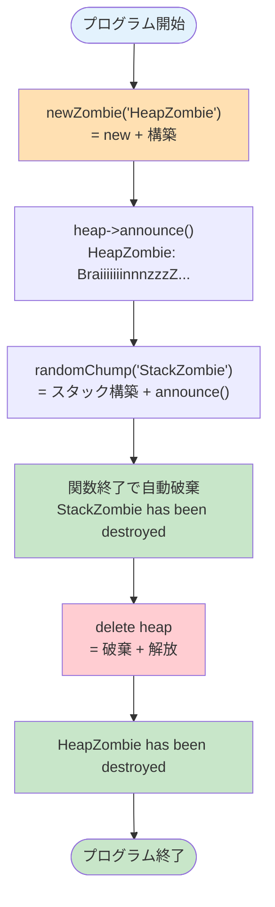

# ex00 — BraiiiiiiinnnzzzZ

---

## このプログラムは何？

**ゾンビを作って「うおおお」と叫ばせるプログラム** です。

ゾンビの作り方を **2通り** 試します。
「ヒープに作る方法」と「スタックに作る方法」の違いを体感するのがゴールです。

```
作り方1: new で作る   → 自分で delete しないとメモリリーク
作り方2: 普通に作る   → 関数が終わると自動で消える
```

---

## 🎯 なぜこの問題？（学習意図）

42 が cpp01 の最初にこれを置く理由：

| 学ばせたいこと | この問題で出会う形 |
|---|---|
| **ヒープ確保** (`new`) | C の `malloc` + 手動初期化 1 ステップから、`new Zombie("name")` で確保 + 構築まで 1 行に |
| **ヒープ解放** (`delete`) | C の `free` + 手動破棄から、`delete z` で破棄 + 解放まで 1 行に |
| **スタック vs ヒープ** | 関数を抜けると消えるオブジェクト と、自分で消すまで残るオブジェクトの違い |
| **「いつ確保すべきか」の判断** | `newZombie` (ヒープ) と `randomChump` (スタック) の使い分けが課題で問われる |

つまり「**メモリの寿命をプログラマが操る感覚**」を最短コードで体感させるのが狙い。
cpp02 以降の OCF（コピー / 代入）、cpp03 の継承、cpp04 の多態性も全部この「**いつ生まれて、いつ死ぬか**」の理解が前提です。

---

## 1. このexerciseで学ぶこと

- **`new`** でヒープにオブジェクトを作る
- **`delete`** でヒープのオブジェクトを消す
- **スタック** に作ったオブジェクトは自動で消える
- コンストラクタとデストラクタが **いつ呼ばれるか** を理解する

---

## 2. `new` って何？ `delete` って何？

### `new` って何？

**「メモリ確保」と「初期化」を 1 行でやってくれる命令** です。

C の `malloc` は「メモリの場所を用意するだけ」。
C++ の `new` は「メモリを用意 + 中身を初期化」まで全部やります。

#### C で Zombie を作る場合（3 ステップ必要）

```c
// ── ステップ1: メモリを確保する ──
// malloc: 指定バイト数のメモリを確保する C の関数
// sizeof(t_zombie): 構造体 t_zombie に必要なバイト数
// z: 確保されたメモリの先頭アドレス
t_zombie *z = malloc(sizeof(t_zombie));

// ── ステップ2: 確保失敗のチェック ──
// malloc は確保できないと NULL を返す
if (z == NULL) return NULL;

// ── ステップ3: メモリの中身を自分で初期化 ──
// init_zombie は「自分で作る初期化関数」
// 中身は例えば:
//   void init_zombie(t_zombie *z, char *name) {
//       strcpy(z->name, name);  // 名前をコピー
//       z->hp = 100;             // HPを設定
//   }
// つまり「構造体のメンバを1つずつ埋める関数」
init_zombie(z, "name");
```

この例の `init_zombie()` は**標準関数ではなく、自分で作る関数**です。
C では構造体を作るたびに、こういう初期化関数を自作する必要があります。

#### C++ で Zombie を作る場合（1 行で完了）

```cpp
// ── 全部を1行でやる ──
// この1行で以下の3つが自動で起きる:
//   ①ヒープにメモリ確保（malloc 相当）
//   ②コンストラクタが呼ばれる（init_zombie 相当）
//   ③"name" が _name に設定される
Zombie *z = new Zombie("name");
```

**図で比較すると:**

```
C の場合:                C++ の場合:
                         
malloc でメモリ確保       new Zombie("name")
    ↓                        |
確保できた？チェック          |  この1行で
    ↓                        |  全部自動的に
init_zombie を呼ぶ           |  やってくれる
    ↓                        |
メンバを1つずつ埋める         ↓
    ↓                     完成！
完成
（3〜4行）                 （1行）
```

!!! info "`new` が「賢い」と言われる理由"
    **コンストラクタを自動で呼んでくれる**からです。

    C では「メモリ確保」と「初期化」が別の作業でした。
    C++ では `new` が両方を 1 つの命令にまとめてくれます。

    - **メモリ確保** = 家の土地を買う
    - **初期化（コンストラクタ）** = 家具を運び込んで住める状態にする

    C は土地だけ買って自分で家具を運ぶ。
    C++ は新築一戸建てが家具付きで届く、みたいな違いです。

### `delete` って何？

**「後片付け」と「メモリ解放」を 1 行でやってくれる命令** です。

C の `free` は「メモリを手放すだけ」。
C++ の `delete` は「デストラクタで後片付け + メモリを手放す」まで全部やります。

#### C で片付ける場合

```c
// ── ステップ1: 後片付けを自分でやる ──
// 例: ファイルを閉じる、他のメモリを free する、等
// cleanup_zombie は「自分で作る後片付け関数」
// 中身は例えば:
//   void cleanup_zombie(t_zombie *z) {
//       if (z->weapon) free(z->weapon);
//       if (z->file)   fclose(z->file);
//   }
cleanup_zombie(z);

// ── ステップ2: メモリを解放する ──
// free: malloc で確保したメモリを返す C の関数
free(z);
```

#### C++ で片付ける場合

```cpp
// ── この1行で以下が自動で起きる ──
//   ①デストラクタが呼ばれる（cleanup_zombie 相当）
//     → クラスが持ってる他のメモリも解放される
//   ②メモリが解放される（free 相当）
delete z;
```

!!! info "`delete` が「賢い」と言われる理由"
    **デストラクタを自動で呼んでくれる**からです。

    Zombie の中で別の `new` をしていたり、
    ファイルを開いていたりしても、
    デストラクタに後片付けを書いておけば `delete` 時に自動で実行されます。

    **開発者が「片付けを忘れる」ミスが減る**のが最大の利点。

### まとめ: `new`/`delete` は 2 つの仕事を 1 つに

| | C（2 ステップ必要） | C++（1 ステップ） |
|---|-------------------|------------------|
| 作る | `malloc` + `init_xxx` を自作 | `new Zombie("name")` |
| 消す | `cleanup_xxx` を自作 + `free` | `delete z` |

**つまり `new`/`delete` は「配列」ではなく「メモリ確保+初期化の自動化」** です。

(配列版の `new[]` / `delete[]` は ex01 で登場します)

!!! danger "鉄則: `new` したら必ず `delete`"
    `new` で作ったものを `delete` しないと
    **メモリリーク**（使われないメモリが残り続ける）が起きます。

### ヒープって何？ スタックって何？

プログラムが使うメモリには **2つの場所** があります。

```
+--- プログラムのメモリ ---+
|                          |
|  スタック (Stack)         |  ヒープ (Heap)
|  +----------------+      |  +----------------+
|  | main()         |      |  |                |
|  |  Zombie z;     | 自動 |  | new Zombie     |
|  |  int x;        | 破棄 |  |                |
|  +----------------+      |  | → delete する  |
|  | func()         |      |  |   まで残る     |
|  |  Zombie z2;    | 自動 |  |                |
|  |              　| 破棄 |  |                |
|  +----------------+      |  +----------------+
|                          |
|  速い / 小さい            |  遅い / 大きい
|  管理不要                 |  自分で管理する
+--------------------------+
```

| | スタック | ヒープ |
|---|---------|--------|
| 作り方 | `Zombie z("name");` | `new Zombie("name");` |
| 消え方 | 関数が終わると **自動で消える** | `delete` するまで **消えない** |
| 速さ | 速い | 少し遅い |
| いつ使う？ | 関数の中だけで使う時 | 関数の外でも使いたい時 |

---

## 3. 課題仕様

| 項目 | 内容 |
|------|------|
| クラス名 | `Zombie` |
| private メンバ | `_name`（ゾンビの名前） |
| メンバ関数 | `announce()` — 名前を叫ぶ |
| デストラクタ | 破棄メッセージを出力 |
| 関数1 | `newZombie(name)` — ヒープに作る |
| 関数2 | `randomChump(name)` — スタックに作る |
| Makefile | `all`, `clean`, `fclean`, `re` |

---

## 4. 実行例

```console
$ make
$ ./zombie
HeapZombie: BraiiiiiiinnnzzzZ...
StackZombie: BraiiiiiiinnnzzzZ...
StackZombie has been destroyed
HeapZombie has been destroyed
```

**注目ポイント**:

- `StackZombie` が **先に** 破棄される（関数終了時に自動で消える）
- `HeapZombie` は `delete` した時に破棄される
- この **順番の違い** がスタックとヒープの違いを示している

---

## 5. C と C++ の比較

=== "C の書き方"

    ```c
    /* printf 用のヘッダ */
    #include <stdio.h>
    /* malloc / free 用のヘッダ */
    #include <stdlib.h>
    /* strcpy 用のヘッダ */
    #include <string.h>

    /* ── 構造体を定義 ── */
    /* C には class がないので struct を使う */
    typedef struct s_zombie {
        /* 名前を格納する50文字の配列 */
        char name[50];
    } t_zombie;

    /* ── ヒープに作る関数 ── */
    t_zombie *new_zombie(char *name) {
        /* ポインタ変数を用意 */
        t_zombie *z;
        /* malloc で必要なバイト数を確保 */
        /* sizeof(t_zombie) = 構造体のサイズ */
        z = malloc(sizeof(t_zombie));
        /* 名前を文字列コピー */
        /* (C++ なら自動だがCは手動) */
        strcpy(z->name, name);
        /* 確保したポインタを返す */
        return z;
    }

    /* ── スタックに作る関数 ── */
    void random_chump(char *name) {
        /* 変数としてスタック上に確保 */
        /* (malloc 不要、自動破棄される) */
        t_zombie z;
        /* 名前をコピー */
        strcpy(z.name, name);
        /* 名前と叫び声を出力 */
        printf("%s: BraiiiiiiinnnzzzZ...\n",
               z.name);
        /* 関数終了 → z が自動で消える */
        /* (スタックの特徴) */
    }

    int main(void) {
        /* ヒープに作る */
        t_zombie *z = new_zombie("Heap");
        /* ヒープゾンビを叫ばせる */
        printf("%s: BraiiiiiiinnnzzzZ...\n",
               z->name);
        /* スタック版を呼ぶ (中で自動破棄) */
        random_chump("Stack");
        /* ヒープのメモリを手動で解放 */
        /* 忘れるとメモリリーク！ */
        free(z);
        return 0;
    }
    ```

=== "C++ の書き方"

    ```cpp
    // cout 用のヘッダ
    #include <iostream>
    // std::string 用のヘッダ
    #include <string>

    // ── Zombie クラスの定義 ──
    // class は「データ + 関数」をまとめる箱
    class Zombie {
    private:
        // 名前 (外から直接触れない)
        // std::string は自動でサイズ管理
        // (Cの char[50] の進化版)
        std::string _name;

    public:
        // ── コンストラクタ ──
        // new や Zombie z("x") の時に
        // 自動で呼ばれる
        // : _name(name) は「初期化子リスト」
        // → _name に name を代入する書き方
        Zombie(std::string name)
            : _name(name) {}

        // ── デストラクタ ──
        // delete や関数終了時に
        // 自動で呼ばれる
        // 後片付けを書く場所
        ~Zombie(void) {
            std::cout << _name
                << " has been destroyed"
                << std::endl;
        }

        // ── メンバ関数 announce ──
        // クラスに属する関数
        void announce(void) {
            std::cout << _name
                << ": BraiiiiiiinnnzzzZ..."
                << std::endl;
        }
    };

    // ── ヒープに作る関数 ──
    // new: メモリ確保 + コンストラクタ呼び出し
    //      を1発でやる
    // (C の malloc + init を合体させた命令)
    Zombie *newZombie(std::string name) {
        return new Zombie(name);
    }

    // ── スタックに作る関数 ──
    void randomChump(std::string name) {
        // new を使わない = スタック上に確保
        // ここでコンストラクタが自動で呼ばれる
        Zombie z(name);
        // z.announce() で叫ぶ
        // (z は変数なので . でアクセス)
        z.announce();
        // 関数終了 → z のデストラクタが
        // 自動で呼ばれる (スタックの特徴)
    }

    int main(void) {
        // ヒープに作る
        // z はポインタ
        Zombie *z = newZombie("Heap");
        // z->announce() で叫ぶ
        // (z はポインタなので -> でアクセス)
        z->announce();
        // スタック版を呼ぶ
        // (中で作って中で自動破棄)
        randomChump("Stack");
        // delete: デストラクタ呼び出し +
        //         メモリ解放 を1発でやる
        // (C の cleanup + free を合体)
        delete z;
        return 0;
    }
    ```

**何が変わった？**

| C | C++ | 一言で言うと |
|---|-----|------------|
| `malloc` + 手動初期化 | `new` | 確保+初期化が一発 |
| `free` | `delete` | 破棄処理+解放が一発 |
| 構造体 (`struct`) | クラス (`class`) | データと関数をまとめられる |
| `printf` | `std::cout` | 出力方法が変わった |

---

## 6. コード解説

### プログラムの流れ



### Zombie.hpp（ヘッダファイル）

```cpp title="Zombie.hpp" linenums="1"
// ── インクルードガード ──
// 同じヘッダが2回読まれるのを防ぐ
#ifndef ZOMBIE_HPP
#define ZOMBIE_HPP

// string: 文字列を使うために必要
#include <string>
// iostream: 画面に文字を出すために必要
#include <iostream>

// ── Zombie クラスの定義 ──
class Zombie {
private:
    // ゾンビの名前（外から直接触れない）
    std::string _name;

public:
    // コンストラクタ: ゾンビを作る時に呼ばれる
    Zombie(std::string name);
    // デストラクタ: ゾンビが消える時に呼ばれる
    ~Zombie(void);
    // 「うおおお」と叫ぶ関数
    void announce(void);
};

// ── クラスの外の関数 ──
// ヒープにゾンビを作る関数
Zombie *newZombie(std::string name);
// スタックにゾンビを作る関数
void    randomChump(std::string name);

#endif
```

### Zombie.cpp（クラスの実装）

```cpp title="Zombie.cpp" linenums="1"
#include "Zombie.hpp"

// ── コンストラクタ ──
// : _name(name) は「初期化子リスト」
// コンストラクタの本体に入る前に
// _name を初期化する書き方
Zombie::Zombie(std::string name)
    : _name(name) {
}

// ── デストラクタ ──
// ゾンビが消える時に自動で呼ばれる
// 「誰が消えたか」を画面に出す
Zombie::~Zombie(void) {
    std::cout << _name
              << " has been destroyed"
              << std::endl;
}

// ── announce ──
// ゾンビの名前と叫び声を表示
void Zombie::announce(void) {
    std::cout << _name
              << ": BraiiiiiiinnnzzzZ..."
              << std::endl;
}
```

!!! tip "初期化子リストって何？"
    `: _name(name)` の部分を **初期化子リスト** と言います。

    ```cpp
    // ✅ 初期化子リスト（おすすめ）
    Zombie::Zombie(std::string name)
        : _name(name) {
    }

    // △ 本体で代入（動くが効率が少し悪い）
    Zombie::Zombie(std::string name) {
        _name = name;
    }
    ```

    初期化子リストは **const メンバ** や **参照メンバ** には **必須** です。
    常にこの書き方を使う癖をつけましょう。

### newZombie.cpp（ヒープに作る）

```cpp title="newZombie.cpp" linenums="1"
#include "Zombie.hpp"

// ── ヒープにゾンビを作る ──
// new で作る → ポインタを返す
// 呼んだ側が delete する責任を持つ
Zombie *newZombie(std::string name) {
    return new Zombie(name);
}
```

!!! info "なぜ `new` で作るのか？"
    関数の **外でも使いたい** からです。

    スタックに作った変数は、関数が終わると消えます。
    消えた変数のアドレスを返すと **ダングリングポインタ**
    （もう存在しないものを指すポインタ）になって危険です。

    ```cpp
    // ダメな例: スタック変数のアドレスを返す
    Zombie *bad() {
        Zombie z("local");
        return &z;
        // z は関数終了で消える
        // → 返したポインタは無効！
    }

    // 良い例: ヒープに作って返す
    Zombie *good() {
        return new Zombie("heap");
        // ヒープのオブジェクトは
        // delete するまで消えない
    }
    ```

### randomChump.cpp（スタックに作る）

```cpp title="randomChump.cpp" linenums="1"
#include "Zombie.hpp"

// ── スタックにゾンビを作る ──
// 関数の中だけで使って、
// 関数が終わると自動で消える
void randomChump(std::string name) {
    // スタック上に Zombie を作る
    // new を使わないのがポイント
    Zombie zombie(name);
    // 叫ばせる
    zombie.announce();
}
// ← ここで zombie は自動的に破棄される
// デストラクタが呼ばれる
// delete は不要！
```

!!! info "なぜスタックで十分なのか？"
    `randomChump()` の中でゾンビを作って叫ばせるだけ。
    **関数の外にゾンビを持ち出さない** ので、
    スタックで十分です。

    スタックなら `delete` を書く必要がないので、
    **メモリリークの心配もゼロ** です。

### main.cpp（メインプログラム）

```cpp title="main.cpp" linenums="1"
#include "Zombie.hpp"

int main(void) {
    // (1) ヒープにゾンビを作る
    // new で作るのでポインタが返ってくる
    Zombie *heap = newZombie("HeapZombie");

    // (2) ポインタ経由で叫ばせる
    // ポインタなので -> を使う
    heap->announce();

    // (3) スタックにゾンビを作る
    // 関数の中で作って叫んで自動破棄
    randomChump("StackZombie");

    // (4) ヒープゾンビを手動で解放
    // これを忘れるとメモリリーク！
    delete heap;

    return 0;
}
```

---

## 7. 評価シートの確認項目

!!! note "評価シート原文"
    > "Turn-in directory: ex00/"
    > "Files to turn in: Makefile, main.cpp, Zombie.{h, hpp},
    > Zombie.cpp, newZombie.cpp, randomChump.cpp"

    Zombie クラスの実装と、
    スタック/ヒープの使い分けができているかが評価のポイント。

- [ ] `make` がエラーも警告もなく通る
- [ ] `newZombie()` で作った Zombie が announce できる
- [ ] `randomChump()` で作った Zombie が announce できる
- [ ] デストラクタのログが正しく出力される
- [ ] ヒープの Zombie を `delete` している
- [ ] メモリリークがない

---

## 8. テストチェックリスト

### 基本動作

- [ ] `make` が警告なく通る
- [ ] `newZombie()` でヒープゾンビが作れる
- [ ] `randomChump()` でスタックゾンビが作れる
- [ ] デストラクタのメッセージが出る

### メモリ管理

- [ ] ヒープゾンビを `delete` している
- [ ] スタックゾンビは自動破棄される
- [ ] `leaks` コマンドでリーク検出なし

### デストラクタの順序

- [ ] スタックゾンビが **先に** 破棄される
- [ ] ヒープゾンビは `delete` 時に破棄される

### 規約

- [ ] `malloc` / `free` を使っていない
- [ ] `printf` を使っていない
- [ ] `using namespace std;` なし
- [ ] クラス名は `Zombie`（UpperCamelCase）
- [ ] `_name` は `private`

---

## 9. ディフェンスで聞かれること

| 質問 | 答え方 | 実装で言うと |
|------|--------|-------------|
| `new` と `malloc` の違いは？ | `new` はメモリ確保 + コンストラクタ呼び出し。`malloc` は確保だけ | `newZombie.cpp` の `return new Zombie(name);` で確保と構築が 1 行 |
| `delete` と `free` の違いは？ | `delete` はデストラクタ + 解放。`free` は即解放のみ | `main.cpp` 末尾の `delete heap;` で `~Zombie()` が呼ばれて `destroyed` を出力 |
| スタックとヒープの違いは？ | スタックは関数終了で自動破棄。ヒープは `delete` するまで残る | `randomChump` 内の `Zombie z(name);` はスタック、`newZombie` の `new Zombie(...)` はヒープ |
| なぜ `newZombie` はヒープに作る？ | 関数の外でもポインタとして使い続けたいから | `Zombie* heap = newZombie("HeapZombie");` のように呼び出し側が寿命を握る |
| なぜ `randomChump` はスタックで十分？ | 関数内だけで使って外に持ち出さない | `randomChump.cpp`: 関数内で `announce()` まで完結。return 不要 |
| 初期化子リストとは？ | コンストラクタ本体の前に `: _name(name)` で初期化 | `Zombie::Zombie(std::string name) : _name(name) {}` で 1 行 |
| ダングリングポインタとは？ | もう存在しないものを指すポインタ。スタック変数のアドレスを返すと起きる | `randomChump` で生成した `Zombie z` のアドレスを return するとアウト（今回はやっていない） |

---

## 10. よくあるミス

!!! warning "`delete` を忘れてメモリリーク"
    ```cpp
    Zombie *z = newZombie("test");
    z->announce();
    // delete を忘れている → メモリリーク
    ```

!!! warning "`new` に対して `free` を使う"
    ```cpp
    Zombie *z = new Zombie("test");
    free(z);   // ダメ！ デストラクタが呼ばれない
    delete z;  // 正しい
    ```

!!! warning "スタック変数のアドレスを返す"
    ```cpp
    Zombie *bad() {
        Zombie z("local");
        return &z;
        // ダメ！ z はすぐ消える
    }
    ```

---

## 💡 ここまでの学びのまとめ

このページで身についたこと:

- **`new` = malloc + コンストラクタ**、**`delete` = デストラクタ + free** の 1 行版
- **スタック**: `Zombie z;` 関数終了で自動破棄。**ヒープ**: `new Zombie(...)` `delete` するまで残る
- 「**寿命を呼び出し元に渡したい**」ならヒープ、「関数内で完結」ならスタック
- **コンストラクタの初期化子リスト** で `_name` を構築時に確定
- **デストラクタが destroyed メッセージを出す** から、いつ消えるか観察できる

!!! tip "ここで詰まったら"
    - 「`delete` を忘れた」→ **メモリリーク**。valgrind で 1 件出る
    - 「`delete` を 2 回呼んだ」→ **二重解放**で SIGABRT
    - 「ローカル変数のアドレスを返した」→ **ダングリングポインタ**。関数を抜けた瞬間アクセス禁止

次の [ex01 Moar brainz!](ex01-zombie-horde.md) では
**`new[]` と `delete[]`** で **配列をまとめて確保 / 解放** します。
角括弧を忘れると即不合格なので注意。

---

## 11. 次の exercise へ

次の [ex01 Moar brainz!](ex01-zombie-horde.md) では、
ゾンビを **まとめて大量に作る** 方法を学びます。

`new[]` と `delete[]` という、配列版の `new` / `delete` が登場します。
