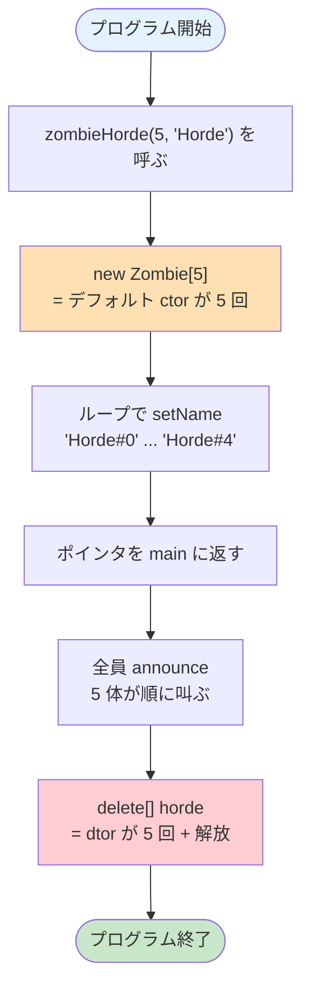

# ex01 — Moar brainz!

---

## このプログラムは何？

**ゾンビの大群（Horde）を一気に作るプログラム** です。

ex00 ではゾンビを1体ずつ作りましたが、
今回は **N体まとめて** ヒープに作ります。
配列の動的確保（`new[]` / `delete[]`）を学ぶのがゴールです。

```
やること:
  1. new Zombie[5] で5体まとめて作る
  2. 全員に名前をつける
  3. 全員叫ばせる
  4. delete[] で全員まとめて消す
```

---

## 🎯 なぜこの問題？（学習意図）

ex00 の続きで、**配列ヒープ確保**を学ばせるために 42 が用意した問題：

| 学ばせたいこと | この問題で出会う形 |
|---|---|
| **`new[]` と `delete[]`** | `new Zombie[N]` で N 個まとめて確保、`delete[] horde` で N 個まとめて解放 |
| **`[]` を忘れたらどうなるか** | `delete horde;` (角括弧なし) は **未定義動作 = 即不合格フラグ** |
| **デフォルトコンストラクタの必要性** | `new[]` は引数なしコンストラクタで初期化するため、`Zombie()` が必須 |
| **後から名前を入れる設計** | コンストラクタに引数を渡せないので、setter / 公開メンバで後付け |

つまり「**N 体まとめて生む + 角括弧の重要性**」を体感する問題。
`new[]` と `delete[]` の 1 文字違いがメモリリーク・クラッシュの分かれ目になる、という C++ の罠を**早めに踏ませる**意図があります。

---

## 1. このexerciseで学ぶこと

- **`new[]`** で配列をまとめてヒープに作る
- **`delete[]`** で配列をまとめて解放する
- **デフォルトコンストラクタ** がなぜ必要か理解する

---

## 2. 新しい概念の解説

### `new[]` って何？

**オブジェクトを複数個まとめて作る** 命令です。
`new` の配列バージョンです。

C で「N個まとめて作る」をやると、3ステップ必要です。
C++ の `new[]` はそれを1行で片付けます。

#### C で N 個まとめて作る場合（3 ステップ）

```c
// ── ステップ1: N個分のメモリを確保 ──
// malloc: 指定バイト数のメモリを確保
// n * sizeof(t_zombie): N体分のバイト数
t_zombie *arr = malloc(
    n * sizeof(t_zombie));

// ── ステップ2: 確保失敗のチェック ──
// malloc は失敗すると NULL を返す
if (arr == NULL) return NULL;

// ── ステップ3: ループで N 回初期化 ──
// init_zombie は自作の初期化関数
// (C では構造体ごとに自分で作る)
// 例:
//   void init_zombie(t_zombie *z) {
//       z->name[0] = '\0';
//       z->hp = 100;
//   }
for (int i = 0; i < n; i++)
    init_zombie(&arr[i]);
```

#### C++ で N 個まとめて作る場合（1 行で完了）

```cpp
// ── この1行で以下が全部起きる ──
//   ①N体分のメモリをヒープに確保
//   ②デフォルトコンストラクタがN回呼ばれる
//     → 各要素が自動で初期化される
// つまり C の malloc + ループ init を合体
Zombie *arr = new Zombie[5];
```

**図で比較すると:**

```
C の場合:                   C++ の場合:

malloc(n*sizeof(...))       new Zombie[5]
    ↓                           |
NULL チェック                    |  この1行で
    ↓                           |  全部自動的に
for ループ                      |  やってくれる
    ↓                           |
  各要素を init_zombie           ↓
    ↓                       完成！
完成
（3〜4行 + ループ）           （1行）
```

### `delete[]` って何？

**`new[]` で作った配列を解放する** 命令です。
**全要素のデストラクタ** を呼んでからメモリを解放します。

C で片付けると「ループで後片付け関数を呼ぶ + free」の
2ステップですが、C++ は `delete[]` 1行で済みます。

#### C で N 個まとめて片付ける場合（2 ステップ）

```c
// ── ステップ1: ループで後片付け関数を呼ぶ ──
// cleanup_zombie は自作の後片付け関数
// 中身の例:
//   void cleanup_zombie(t_zombie *z) {
//       if (z->weapon) free(z->weapon);
//   }
for (int i = 0; i < n; i++)
    cleanup_zombie(&arr[i]);

// ── ステップ2: メモリをまとめて解放 ──
// free: malloc で確保したメモリを返す
free(arr);
```

#### C++ で N 個まとめて片付ける場合（1 行）

```cpp
// ── この1行で以下が全部起きる ──
//   ①全要素のデストラクタがN回呼ばれる
//     → 各要素の後片付けが自動で走る
//   ②配列全体のメモリが解放される
// C の ループ cleanup + free を合体
delete[] arr;
```

!!! danger "絶対に間違えてはいけないルール"
    ```
    new    で作った → delete    で消す
    new[]  で作った → delete[]  で消す
    ```

    **`new[]` に対して `delete`（[]なし）を使うと
    未定義動作**（何が起きるかわからない）になります。

### デフォルトコンストラクタって何？

**引数なしのコンストラクタ** のことです。

`new Zombie[5]` は5体のゾンビを一気に作りますが、
1体ずつに「名前」を渡す方法がありません。
だから **引数なしで作れるコンストラクタ** が必要です。

```cpp
// デフォルトコンストラクタ
Zombie::Zombie(void) {
    // 引数なし。名前は後で設定する
}

// new[] はこのコンストラクタを使う
Zombie *arr = new Zombie[5];

// 名前は後から setter で設定
for (int i = 0; i < 5; i++)
    arr[i].setName("Horde");
```

```
new Zombie[5] の動き:

  +--------+--------+--------+--------+--------+
  | Zombie | Zombie | Zombie | Zombie | Zombie |
  | (空)   | (空)   | (空)   | (空)   | (空)   |
  +--------+--------+--------+--------+--------+
     ↑ デフォルトコンストラクタで作られる

  setName() で名前を設定:
  +--------+--------+--------+--------+--------+
  | Horde  | Horde  | Horde  | Horde  | Horde  |
  |  #0    |  #1    |  #2    |  #3    |  #4    |
  +--------+--------+--------+--------+--------+
```

!!! info "なぜ `new[]` は各要素に引数を渡せないの？"
    `new Zombie[5]("Foo")` のように書ければ便利そうですが、**C++ の言語仕様で禁止されています**。理由は `new[]` の構文が

    > 「**N 個の T を作れ**」

    という**一括命令**になっているからです。「各要素にどんな引数を渡すか」を 1 個ずつ細かく指定する仕組みは設計時から入っていません。

    ```cpp
    new Zombie[5]("Foo");   // ← コンパイルエラー
    new Zombie[5];          // ← OK (各要素はデフォルト構築)
    ```

    結果として `new T[N]` で配列を確保するなら、**`T` にデフォルトコンストラクタ (引数なしで呼べるコンストラクタ) が必須** という制約が出てきます。

    **回避策 (cpp01 では使わなくて OK):**

    - `std::vector<T>` を使うと `vector<T> v(5, T("Foo"))` のように初期値を渡せる (cpp08-09 の話)
    - C++11 以降は `new T[5]{T("a"), T("b"), ...}` も書ける (C++98 では不可)

    つまり cpp01 のこの exercise では「**配列確保 → デフォルト構築 → 後から setter で設定**」というパターンが王道で、それを練習するのがゴールです。

---

## 3. 課題仕様

| 項目 | 内容 |
|------|------|
| 関数名 | `zombieHorde(int N, std::string name)` |
| 動作 | N体のZombieをヒープに作り、全員に同じ名前をつける |
| 戻り値 | 最初のZombieへのポインタ |
| 解放 | 呼び出し側で `delete[]` する |
| 追加するもの | デフォルトコンストラクタ、`setName()` |

---

## 4. 実行例

```console
$ make
$ ./zombieHorde
Horde#0: BraiiiiiiinnnzzzZ...
Horde#1: BraiiiiiiinnnzzzZ...
Horde#2: BraiiiiiiinnnzzzZ...
Horde#3: BraiiiiiiinnnzzzZ...
Horde#4: BraiiiiiiinnnzzzZ...
Horde#4 has been destroyed
Horde#3 has been destroyed
Horde#2 has been destroyed
Horde#1 has been destroyed
Horde#0 has been destroyed
```

**注目**: `delete[]` で **全員のデストラクタ** が呼ばれています。

---

## 5. C と C++ の比較

=== "C の書き方"

    ```c
    /* printf 用のヘッダ */
    #include <stdio.h>
    /* malloc / free 用のヘッダ */
    #include <stdlib.h>
    /* sprintf を使う時もこのヘッダ */
    #include <string.h>

    /* ── 構造体を定義 ── */
    /* 名前だけ持つ単純な構造体 */
    typedef struct s_zombie {
        /* 50文字までの名前 */
        char name[50];
    } t_zombie;

    /* ── N体をまとめて確保する関数 ── */
    t_zombie *zombie_horde(int n,
                           char *name) {
        /* ループ変数 */
        int i;
        /* 配列の先頭ポインタ */
        t_zombie *arr;
        /* N個分のメモリを一括で確保 */
        /* n * sizeof(...) が合計バイト数 */
        arr = malloc(n * sizeof(t_zombie));
        /* 各要素を手動で初期化 */
        /* (C++ ならコンストラクタが自動) */
        for (i = 0; i < n; i++)
            /* sprintf: 書式付きで文字列生成 */
            /* "H#0", "H#1" ... を作る */
            sprintf(arr[i].name,
                    "%s#%d", name, i);
        /* 配列の先頭アドレスを返す */
        return arr;
    }

    int main(void) {
        /* ループ変数 */
        int i;
        /* 5体まとめて確保 */
        t_zombie *h = zombie_horde(5, "H");
        /* 全員分をループで表示 */
        for (i = 0; i < 5; i++)
            /* h[i].name で i 番目の名前を取得 */
            printf("%s: Brainz...\n",
                   h[i].name);
        /* 配列全体をまとめて解放 */
        /* ※ C には delete[] がないので free 1回 */
        free(h);
        return 0;
    }
    ```

=== "C++ の書き方"

    ```cpp
    // cout 用のヘッダ
    #include <iostream>
    // std::string 用のヘッダ
    #include <string>
    // stringstream (数字と文字の連結) 用
    #include <sstream>

    // ── Zombie クラスの定義 ──
    class Zombie {
    private:
        // 名前 (外から直接触れない)
        std::string _name;
    public:
        // ── デフォルトコンストラクタ ──
        // 引数なし。new[] で呼ばれる
        Zombie(void) {}
        // ── デストラクタ ──
        // delete[] 時に全要素分呼ばれる
        ~Zombie(void) {
            std::cout << _name
                << " has been destroyed"
                << std::endl;
        }
        // 後から名前を設定するセッター
        void setName(std::string name) {
            _name = name;
        }
        // 叫ぶメンバ関数
        void announce(void) {
            std::cout << _name
                << ": BraiiiiiiinnnzzzZ..."
                << std::endl;
        }
    };

    // ── N体をまとめて作る関数 ──
    Zombie *zombieHorde(int N,
                        std::string name) {
        // new[]: malloc + ループ init を1発
        // デフォルトコンストラクタがN回呼ばれる
        Zombie *h = new Zombie[N];
        // ループで名前を設定
        for (int i = 0; i < N; i++) {
            // stringstream: 文字列と数字を
            // くっつける道具 (sprintf 相当)
            std::stringstream ss;
            // << で連結 "Horde" + "#" + i
            ss << name << "#" << i;
            // .str() で std::string に変換
            h[i].setName(ss.str());
        }
        // 先頭ポインタを返す
        return h;
    }

    int main(void) {
        // 作る数
        int N = 5;
        // N体まとめて確保
        Zombie *h = zombieHorde(N, "Horde");
        // 全員叫ばせる
        for (int i = 0; i < N; i++)
            // h[i] で i 番目にアクセス
            // 配列要素なので . を使う
            h[i].announce();
        // delete[]: ループで全員の
        // デストラクタを呼ぶ + free を1発
        delete[] h;
        return 0;
    }
    ```

---

## 6. コード解説

### プログラムの流れ



### Zombie.hpp（ヘッダファイル）

```cpp title="Zombie.hpp" linenums="1"
#ifndef ZOMBIE_HPP
#define ZOMBIE_HPP

#include <string>
#include <iostream>

class Zombie {
private:
    // ゾンビの名前
    std::string _name;

public:
    // 引数なしコンストラクタ（new[] に必要）
    Zombie(void);
    // 引数ありコンストラクタ
    Zombie(std::string name);
    // デストラクタ
    ~Zombie(void);
    // 叫ぶ
    void announce(void);
    // 名前を設定する
    void setName(std::string name);
};

// N体のゾンビをまとめて作る関数
Zombie *zombieHorde(
    int N,
    std::string name
);

#endif
```

### zombieHorde.cpp（配列確保の核心）

```cpp title="zombieHorde.cpp" linenums="1"
#include "Zombie.hpp"
// stringstream: 文字列と数字をくっつける
#include <sstream>

Zombie *zombieHorde(
    int N,
    std::string name
) {
    // N体分のメモリをまとめて確保
    // デフォルトコンストラクタがN回呼ばれる
    Zombie *horde = new Zombie[N];

    // 1体ずつ名前を設定
    for (int i = 0; i < N; i++) {
        // stringstream で名前と番号を連結
        // "Horde" + "#" + "0" → "Horde#0"
        std::stringstream ss;
        ss << name << "#" << i;
        horde[i].setName(ss.str());
    }
    // 配列の先頭ポインタを返す
    // 呼び出し側が delete[] する責任を持つ
    return horde;
}
```

!!! tip "`std::stringstream` って何？"
    文字列と数字をくっつけるための道具です。
    C の `sprintf` の代わりに使います。

    ```cpp
    std::stringstream ss;
    ss << "Horde" << "#" << 3;
    std::string result = ss.str();
    // result は "Horde#3"
    ```

### main.cpp（メインプログラム）

```cpp title="main.cpp" linenums="1"
#include "Zombie.hpp"

int main(void) {
    // 何体作るか
    int N = 5;

    // N体まとめてヒープに作る
    Zombie *horde = zombieHorde(N, "Horde");

    // 全員叫ばせる
    for (int i = 0; i < N; i++)
        horde[i].announce();

    // 全員まとめて解放
    // delete[] で全員のデストラクタが呼ばれる
    delete[] horde;

    return 0;
}
```

---

## 7. 評価シートの確認項目

!!! note "評価シート原文"
    > "Turn-in directory: ex01/"
    > "Files to turn in: Makefile, main.cpp, Zombie.{h, hpp},
    > Zombie.cpp, zombieHorde.cpp"

    `new[]` と `delete[]` の正しい使い方が評価のポイント。

- [ ] `zombieHorde` が `new[]` を使っている
- [ ] 全 Zombie に名前が設定されている
- [ ] `delete[]` で解放している
- [ ] メモリリークがない

---

## 8. テストチェックリスト

### 基本動作

- [ ] `make` が警告なく通る
- [ ] N体のゾンビが生成される
- [ ] 全員 announce できる
- [ ] デストラクタがN回呼ばれる

### エッジケース

- [ ] N = 0 でクラッシュしない
- [ ] N = 1 で正常動作
- [ ] N = 100 で正常動作

### メモリ管理

- [ ] `new[]` で配列を確保している
- [ ] `delete[]` で配列を解放している
- [ ] メモリリークなし

### 規約

- [ ] `malloc` / `free` 不使用
- [ ] `printf` 不使用
- [ ] `using namespace std;` なし

---

## 9. ディフェンスで聞かれること

| 質問 | 答え方 | 実装で言うと |
|------|--------|-------------|
| `delete` と `delete[]` の違いは？ | `delete` は 1 個。`delete[]` は配列要素の全 dtor を呼んで解放 | `main.cpp` の最後で `delete[] horde;` 必須。`delete horde;` だと未定義動作 |
| なぜデフォルトコンストラクタが必要？ | `new Zombie[N]` は各要素を引数なしで構築するから | `Zombie.hpp` に `Zombie();` を宣言、`Zombie.cpp` で `Zombie::Zombie() {}` を定義 |
| `new[]` に `delete` を使うとどうなる？ | 未定義動作。先頭 1 体だけ dtor が走る可能性 | この実装では `delete[] horde;` と必ず `[]` を付ける |
| なぜ `setName()` が必要？ | `new[]` は各要素に引数を渡せないため、後付け | `Zombie.hpp` に `void setName(std::string n);` を追加し、`zombieHorde` 内のループで呼ぶ |
| `std::stringstream` とは何？ | 文字列と数字を連結する道具。C の `sprintf` の代替 | `zombieHorde.cpp`: `std::stringstream ss; ss << name << "#" << i; horde[i].setName(ss.str());` |

---

## 10. よくあるミス

!!! warning "`delete` と `delete[]` の混同"
    ```cpp
    // new[] で作ったのに...
    Zombie *h = new Zombie[5];
    delete h;     // ダメ！ 未定義動作
    delete[] h;   // 正しい！
    ```

!!! warning "デフォルトコンストラクタの定義忘れ"
    ```cpp
    // デフォルトコンストラクタがないと...
    Zombie *h = new Zombie[5];
    // → コンパイルエラー！
    ```

!!! warning "N が 0 の場合"
    `new Zombie[0]` は合法です（空の配列）。
    ただし `delete[]` は必要です。

---

## 💡 ここまでの学びのまとめ

このページで身についたこと:

- **`new[]` / `delete[]` は対** で使う。**`[]` を片方忘れたら未定義動作**
- **配列の各要素はデフォルトコンストラクタで初期化** → `Zombie()` が必須
- 引数を渡せない代わりに、**setter で後付け** する設計パターン
- **`std::stringstream`** で「文字列 + 数字」の連結を型安全に

!!! tip "ここで詰まったら"
    - 「コンパイルエラー: `Zombie::Zombie()` がない」→ デフォルトコンストラクタを定義
    - 「valgrind が leak と言う」→ `delete` の `[]` 忘れか、`delete[]` 自体を忘れている
    - 「クラッシュする」→ `delete[]` のあとに `horde[i]` を触っていないか

次の [ex02 HI THIS IS BRAIN](ex02-brain.md) では
**参照 (`&`)** で「ポインタじゃない別名」を学びます。
ポインタとどう違うのか、なぜ別の機能になっているのか、を実コードで確かめます。

---

## 11. 次の exercise へ

次の [ex02 HI THIS IS BRAIN](ex02-brain.md) では、
**ポインタと参照の違い** を実際に確かめます。

「参照って何？」がわかる、とてもシンプルな exercise です。
